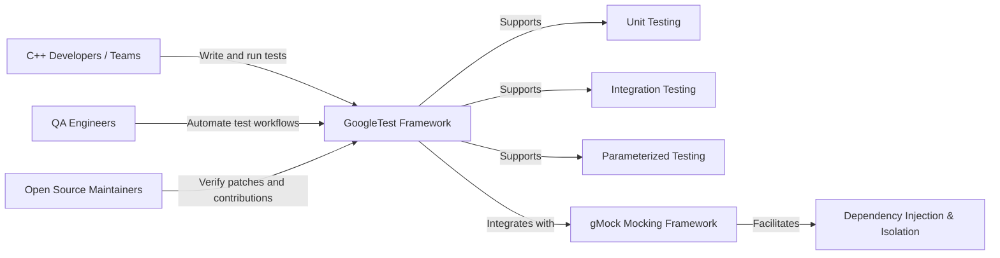

# Target Audience & Typical Use Cases

## Who Benefits Most from GoogleTest?

GoogleTest is the premier C++ testing framework designed to empower a wide spectrum of users who seek to improve the quality, reliability, and maintainability of their C++ codebases. It shines for:

- **C++ Developers and Engineers:** Those building software products who need to write robust unit and integration tests quickly and effectively.
- **Quality Assurance (QA) Professionals:** Engineers focusing on testing automation, seeking deep integration with C++ projects.
- **Open Source Contributors and Project Maintainers:** Those who want a dependable framework to ensure code correctness while facilitating community contributions.

Its adaptable design caters equally well to individuals working on embedded systems, high-performance applications, desktop software, or large-scale distributed systems.

## Why Choose GoogleTest?

Testing C++ code can be notoriously challenging due to the language's complexity and varied use cases. GoogleTest addresses these challenges by providing:

- **Comprehensive Test Support:** Covers a range of test types including unit, integration, and parameterized tests.
- **Rich Assertion Library:** Enables expressive and readable assertions simplifying the verification of expected outcomes.
- **Automatic Test Discovery & Execution:** Streamlines running and managing large numbers of tests.
- **Seamless Mocking Integration via gMock:** Allows testing in isolation by easily mocking dependencies.
- **Cross-Platform Compatibility:** Supports all major operating systems where C++ is used.

Together, these features allow developers to focus on writing meaningful tests rather than scaffolding them.

## Typical Use Cases and Storytelling Scenarios

### 1. Accelerating Development with Test-Driven Design
Alice, a C++ engineer building a network service, uses GoogleTest to write tests before implementation. She defines expectations clearly with gMock mocks, ensuring each module behaves correctly in isolation, reducing bugs early.

### 2. Safeguarding Legacy Codebases
Bob maintains a large legacy codebase with minimal tests. Integrating GoogleTest helps him incrementally add tests around critical components without disrupting stability, improving confidence in continuous deployment.

### 3. Automating Complex Systems Testing
Carol is part of an embedded systems team. They use GoogleTest’s parameterized tests to efficiently cover a wide range of hardware configurations and edge cases automatically.

### 4. Open Source Project Quality Gate
Open source maintainers rely on GoogleTest to verify patches submitted by contributors adhere to project standards. The framework’s detailed reports and failure messages help guide contributors in improving code quality.

## Real-World Examples of GoogleTest in Action

GoogleTest enjoys wide adoption, powering testing infrastructures in many prominent projects and organizations:

- **Software Giants:** Companies like Google use it internally for numerous projects, reinforcing their quality standards.
- **Popular Libraries:** Many widely used C++ libraries and frameworks integrate GoogleTest, showing it scales from small to very large codebases.
- **Academic and Research Institutions:** Trusted for developing research software where correctness and reproducibility are critical.

## Overview Diagram

## Summary

GoogleTest empowers C++ developers, QA teams, and open source contributors to write reliable, maintainable, and expressive tests. It simplifies testing challenges across diverse domains—from legacy systems to modern, high-performance applications—enabling better design, faster development cycles, and higher software quality.

## Getting Started

If you are new to GoogleTest or want to explore how it works with mocks, consider visiting the following pages next:

- [gMock for Dummies](https://google.github.io/googletest/gmock_for_dummies.html) — Learn how to mock interfaces with gMock.
- [Feature Summary](https://google.github.io/googletest/overview/feature-overview/feature-summary) — See an overview of core GoogleTest features.
- [Writing and Structuring Effective Tests](https://google.github.io/googletest/guides/core-workflows/writing-effective-tests) — Learn best practices for test design.

---

<Tag url="https://github.com/google/googletest" />

---

## Additional Resources

- [Overview/Product Introduction: What is GoogleTest?](https://google.github.io/googletest/overview/product-intro-and-value/what-is-googletest)
- [Core Concepts & Terminology](https://google.github.io/googletest/overview/architecture-and-concepts/core-concepts-and-terminology)
- [Mocking Using gMock](https://google.github.io/googletest/gmock_for_dummies.html)

---