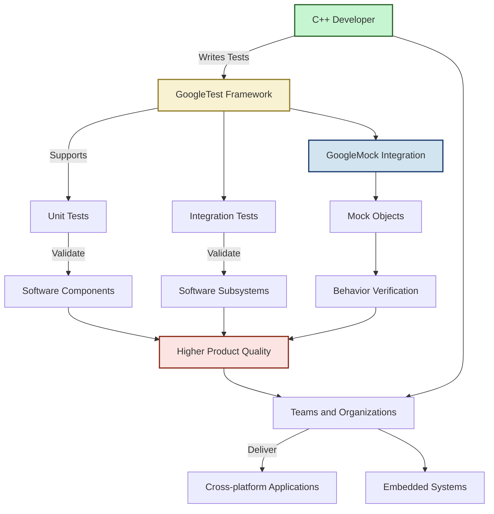

# Who Uses GoogleTest? Typical Use Cases

GoogleTest is a versatile C++ testing framework widely adopted across the software development landscape. Its reach spans from individual developers working on open-source projects to large enterprise teams building cross-platform applications.

## C++ Developers in Open Source and Enterprise

Whether you are a solo developer maintaining a library or part of a distributed team releasing product-grade software, GoogleTest provides a robust foundation for ensuring code correctness and quality throughout the development lifecycle.

### Common Usage Scenarios

GoogleTest is integral in various testing practices, helping teams and developers achieve confidence and scalability in their testing routines:

- **Unit Testing:** Isolate and test individual components or classes. GoogleTest simplifies writing targeted, fast unit tests that verify internal logic without external dependencies.

- **Integration Testing:** Verify interactions between multiple components or subsystems in controlled test environments. GoogleTest's flexible architecture allows you to build layered tests that simulate real-world usage.

- **Mocking Collaborators:** Through its GoogleMock integration, GoogleTest enables the creation of mock objects to simulate dependencies, isolate behavior, and verify interactions, making tests more reliable and maintainable.

### Real-World Projects and Platforms

GoogleTest is trusted by projects across domains and industries, including but not limited to:

- **Large-scale software systems and frameworks:** Leveraging GoogleTest in critical CI pipelines to detect regressions early.
- **Embedded systems and firmware:** Facilitating tests on constrained platforms.
- **Cross-platform desktop and mobile applications:** Providing consistent test results across Windows, Linux, macOS, Android, and iOS.

### Example: Testing with Mocks

Consider a network client that depends on a connection interface. Using GoogleTest paired with GoogleMock, developers can replace the real connection with a mock object, specifying expected method calls and outcomes, which enables precise testing of the client's error handling and protocol logic without requiring a live network.

```cpp
#include <gmock/gmock.h>
#include <gtest/gtest.h>

class Connection {
 public:
  virtual ~Connection() {}
  virtual bool Connect() = 0;
  virtual int Send(const std::string& data) = 0;
};

class MockConnection : public Connection {
 public:
  MOCK_METHOD(bool, Connect, (), (override));
  MOCK_METHOD(int, Send, (const std::string& data), (override));
};

TEST(NetworkClientTest, SendsDataSuccessfully) {
  MockConnection mock_conn;
  EXPECT_CALL(mock_conn, Connect())
      .WillOnce(::testing::Return(true));
  EXPECT_CALL(mock_conn, Send(::testing::_))
      .WillOnce(::testing::Return(5));

  // ... code that uses mock_conn and calls Connect/Send ...
}
```

This test avoids the complexity and instability of real network interactions by asserting precise expected behavior on mock objects.

## Why This Matters

Using GoogleTest enables developers to: 

- Write **reliable tests** that validate system behavior early and often.
- Maintain **code quality** across diverse teams and evolving codebases.
- Perform **fast, automated verification**, reducing manual testing overhead.
- Facilitate **clear communication** of software contracts and expectations through test code.

## Next Steps

To maximize the benefits shown here, explore these related topics:

- [What is GoogleTest?](overview/product-intro-and-value/what-is-google-test) for foundational concepts.
- [Mocking: Mock Objects & Expectations](overview/feature-summary-and-workflows/mocking-mock-objects-overview) for detailed mocking strategies.
- [GoogleTest Tutorials and Samples](overview/product-intro-and-value/target-audience-usecases) for practical examples.


---

> For more on mocking and extending test coverage with mocks, see [GoogleMock README](googlemock/README.md) and [gMock for Dummies](docs/gmock_for_dummies.md).

> Troubleshooting tips and advanced configurations can be found in the [Legacy gMock FAQ](docs/gmock_faq.md).

> Developers seeking a quick reference may consult the [Mocking Reference guide](docs/reference/mocking.md).


---

### Visualizing Typical Use Cases


```

---

<Tip>
GoogleTest seamlessly scales from simple unit tests to complex integration suites incorporating mocks, making it your foundation for maintaining code quality at any scale.
</Tip>

<Warning>
Effective use of mocks requires care: only mock interfaces you own or have clearly defined interaction requirements for, to avoid brittle tests.
</Warning>