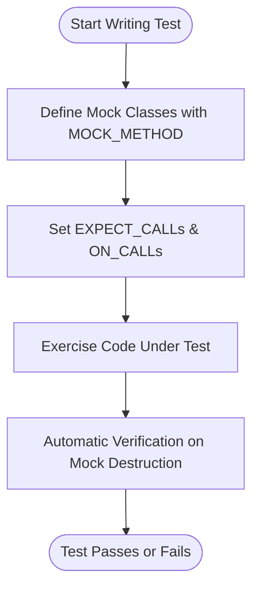

# Core Features at a Glance

Welcome to the concise yet comprehensive showcase of **GoogleTest** and **GoogleMock** — the cornerstone frameworks for C++ testing and mocking. This page distills the essential capabilities you need to know to efficiently write, manage, and scale your tests.

---

## Unlock Rigorous, Readable Testing

GoogleTest empowers you with an expressive yet intuitive test discovery system and a rich assertion library that covers everything from simple checks to complex condition validations. Whether you're verifying algorithm correctness or system behavior, GoogleTest's versatile features simplify expressing your intent while providing powerful diagnostics.

- **Automatic Test Discovery:** Define tests with macros that GoogleTest identifies and runs automatically, freeing you from manual test management.
- **Rich Assertions:** Use a broad spectrum of assertions for equality, exceptions, predicates, and more, with detailed output on failures.
- **Parameterized Testing:** Write a single test logic and run it with different data sets, ensuring thorough coverage without code duplication.
- **Type-Parameterized Tests:** Test your templates and generic code by validating behavior for multiple types effortlessly.

## Master Advanced Mocking with GoogleMock

GoogleMock integrates seamlessly with GoogleTest to let you create mock objects with ease. It offers an expressive syntax for defining expected function calls, controls call order, and manipulates return values, enabling thorough interaction-based testing.

- **Declarative Mock Definitions:** Define mock classes quickly using `MOCK_METHOD` macros, simplifying the creation of mock implementations.
- **Flexible Expectation Setup:** Specify how many times and in what order methods should be called using `EXPECT_CALL`, with powerful matchers to validate arguments.
- **Default and Custom Actions:** Control method return values and side effects with built-in and custom actions to simulate diverse scenarios.
- **Strictness Control:** Use `NiceMock`, `NaggyMock`, or `StrictMock` variants to balance verbosity and enforcement of mock method calls.

## Seamless Integration and Testing Workflow

GoogleTest and GoogleMock fit naturally into your development process, allowing you to write tests that are clean, maintainable, and easy to debug.

- **Automatic Verification:** Mock expectations automatically verify on destruction, catching violations precisely when they occur.
- **Sequence and Ordering:** Define call order via sequences or partial order to reflect complex interaction requirements.
- **Efficient Failure Feedback:** Informative stack traces and detailed error messages pinpoint exactly why a test failed.

## Real-World Example

Imagine you want to verify that your graphics program interacts properly with a drawing API abstracted as a `Turtle` interface:

```cpp
#include <gmock/gmock.h>

class Turtle {
 public:
  virtual ~Turtle() {}
  virtual void PenUp() = 0;
  virtual void PenDown() = 0;
  virtual void Forward(int distance) = 0;
  virtual int GetX() const = 0;
};

class MockTurtle : public Turtle {
 public:
  MOCK_METHOD(void, PenUp, (), (override));
  MOCK_METHOD(void, PenDown, (), (override));
  MOCK_METHOD(void, Forward, (int distance), (override));
  MOCK_METHOD(int, GetX, (), (const, override));
};

using ::testing::AtLeast;

TEST(PainterTest, DrawsCircle) {
  MockTurtle mock_turtle;
  EXPECT_CALL(mock_turtle, PenDown()).Times(AtLeast(1));
  Painter painter(&mock_turtle);
  EXPECT_TRUE(painter.DrawCircle(0, 0, 10));
}
```

This test checks that the paint operation calls `PenDown()` at least once, ensuring the drawing follows the expected interaction pattern.

## Why This Matters to You

Take control over your tests with GoogleTest and GoogleMock to:

- Create **deterministic, fast tests** by replacing external dependencies with mocks.
- Write **clear, maintainable tests** that express intent and catch errors early.
- Optimize **test coverage and robustness** with parameterized and type-parameterized tests.
- **Detect incorrect interactions** through expressive mock expectations and verifications.

## Getting Started Preview

You’re poised to take your testing skills to the next level. Begin by setting up your environment and installing GoogleTest/GMock. Then, explore writing your first test and mock, discovering how each feature fits your workflow.

From here, dive into:

- [What is GoogleTest & GoogleMock?](/overview/product-intro-core-concepts/what-is-googletest)
- [gMock Cookbook for practical recipes](https://google.github.io/googletest/gmock_cook_book.html)
- [Comprehensive gMock Reference Documentation](/docs/reference/mocking.md)

---

<AccordionGroup title="Additional Resources">
<Accordion title="GoogleTest Overview & Core Concepts">
Deep dive into the foundations of GoogleTest and GoogleMock including test structuring and mocking techniques.
</Accordion>
<Accordion title="gMock Cookbook">
Step-by-step recipes on creating mocks, setting expectations, using matchers, and controlling behavior.
</Accordion>
<Accordion title="Mocking Reference">
Detailed reference for macros, classes, and functions in GoogleMock including `MOCK_METHOD`, `EXPECT_CALL`, and related API.
</Accordion>
<Accordion title="gMock Cheat Sheet">
Quick references for common mocking patterns, mock class definitions, and standard expectation setups.
</Accordion>
</AccordionGroup>


---

### Diagram: Typical Mocking Workflow




---

For a comprehensive understanding, this overview links directly to both introductory and advanced guides, equipping you with everything from initial test writing to mastering complex mocking scenarios.

---

*This page provides a focused summary of the headline features in GoogleTest and GoogleMock, guiding developers on why and how these components will empower their C++ testing efforts.*


---

### Code Example: Simplifying Mock Setup

```cpp
#include <gmock/gmock.h>

class Interface {
 public:
  virtual ~Interface() {}
  virtual int Compute(int x) = 0;
};

class MockInterface : public Interface {
 public:
  MOCK_METHOD(int, Compute, (int x), (override));
};

TEST(ComputeTest, ReturnsExpectedResult) {
  MockInterface mock;
  EXPECT_CALL(mock, Compute(::testing::Gt(0)))
      .WillRepeatedly(::testing::Return(42));

  int result = mock.Compute(5);
  EXPECT_EQ(42, result);
}
```

This code demonstrates the simplicity with which GoogleMock lets you create mocks and specify behavior with intuitive matchers and flexible expectation syntax.

---

### Troubleshooting Tips

- **Uninteresting Calls:** By default, calls to mock methods without expectations result in warnings. Suppress them by using `NiceMock` if the calls are intentional and not worth explicit expectations.
- **Ordering Problems:** Use `InSequence` or `After` clauses in `EXPECT_CALL` to enforce call order and diagnose sequence issues.
- **Match Failure:** Run tests with the `--gmock_verbose=info` flag to trace which expectations were considered and why some calls may not match.

---

Harness the power of GoogleTest and GoogleMock to write tests that are robust, readable, and actionable.

---