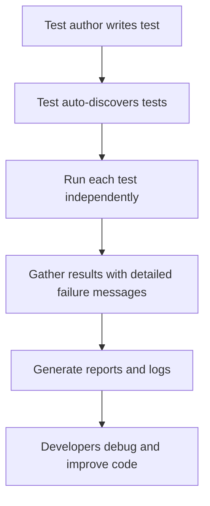

# Core Philosophy & Benefits

GoogleTest is built on a set of core philosophies and design principles that drive its ease of use, expressiveness, and powerful test discovery capabilities. These foundations ensure that the framework not only fits seamlessly into developers’ daily workflows but also promotes long-term quality and maintainability of test suites.

## Design Principles

- **User-Centric Simplicity**: GoogleTest prioritizes straightforwardness in writing and running tests. By focusing on what developers want to accomplish with tests rather than intricate internal details, the framework empowers users to create reliable tests quickly and efficiently.

- **Expressiveness & Clarity**: The API is designed to clearly express testing intentions. Assertions, fixtures, and test cases are named and structured to closely reflect test logic, improving readability and reducing cognitive load in complex test scenarios.

- **Automatic Test Discovery**: GoogleTest automatically detects and runs all defined tests without requiring manual enumeration. This removes repetitive setup and ensures all tests are consistently executed, fostering confidence in test coverage.

- **Integration with xUnit Patterns**: Built on xUnit architecture, GoogleTest embraces proven testing patterns such as fixtures, assertions, and setup/teardown behaviors. This alignment enhances test organization and makes migration from other tools easier.

- **Portability and Flexibility**: Supporting multiple platforms and compilers, GoogleTest ensures that tests run uniformly across environments, allowing developers to maintain a single test codebase for diverse deployments.

- **Extensibility and Maintainability**: By encouraging writing tests through public interfaces and supporting advanced features like parameterized tests, users can evolve their test suites in a scalable, maintainable way.

## Impact on Daily Developer Workflows

GoogleTest’s philosophies translate into tangible benefits for developers and teams:

- **Faster Test Writing**: Its clean syntax and meaningful assertions reduce boilerplate, allowing developers to concentrate on the logic that matters.

- **Reliable Test Runs**: Automated discovery and repeatable execution help quickly surface regressions, supporting continuous integration pipelines.

- **Easier Debugging**: Informative failure messages and structured test output mean failures are easier to diagnose and fix.

- **Scalable Test Suites**: Advanced patterns like parameterized and type-parameterized tests align with complex codebases that require broad validation.

## Why These Principles Matter

In the evolving landscape of software development, maintaining robust automated tests is crucial. GoogleTest puts test quality and developer productivity first by:

- Ensuring tests are consistent and isolated, reducing flaky and interdependent tests.
- Supporting a wide variety of testing needs from unit to integration tests, making it a versatile testing backbone.
- Providing a solid, extensible foundation to build and maintain a healthy test ecosystem.

## Further Exploration

This page offers a conceptual foundation. For practical application, explore related content:

- [GoogleTest Primer](/docs/primer.md): Step-by-step instructions to get started with writing and running tests.
- [Assertions Reference](/docs/reference/assertions.md): Detailed explanation of assertion types and usage.
- [Parameterized and Type-Parameterized Tests](/guides/advanced-testing-strategies/parameterized-and-typed-tests): Learn how to write more scalable and flexible tests.
- [Running and Configuring Tests](/api-reference/core-testing-api/running-and-configuring-tests): Manage test execution and environment customization.

<Tip>
Incorporate these guiding principles early in your testing practices to maximize both immediate productivity and long-term code health.
</Tip>

<Note>
Remember that GoogleTest's design choices are deeply rooted in industry best practices and real-world usage, offering a proven framework for C++ test automation.
</Note>

<Warning>
Avoid mixing test styles or skipping setup validation, as it can undermine the benefits these philosophies provide.
</Warning>

### Summary

- Core design principles that make GoogleTest simple, expressive, and powerful
- How these principles improve user workflows and test quality
- Key reasons why these philosophies drive better testing outcomes
- Links to practical guides and references for deeper understanding

---

## Example: Expressiveness in Action

```cpp
TEST(FactorialTest, HandlesZeroInput) {
  ASSERT_EQ(Factorial(0), 1) << "Factorial of zero should be one.";
}
```

This example embodies clarity and user intent, directly mapping to the expected behavior.

## Visualization: User Test Flow



This flow highlights how design principles enable a smooth testing lifecycle.

## Best Practices & Tips

- Organize tests into suites that reflect code structure to leverage shared fixtures.
- Use meaningful assertion messages to improve failure diagnostics.
- Employ parameterized tests to cover multiple cases without duplication.
- Integrate GoogleTest within build and CI systems for consistent validation.

## Common Pitfalls to Avoid

- Mixing TEST and TEST_F in the same suite can cause issues; keep fixture usage consistent.
- Neglecting to call `InitGoogleTest()` before running tests may cause unexpected behavior.
- Overusing fatal assertions (`ASSERT_`) when non-fatal (`EXPECT_`) would suffice can hinder test execution.

## Troubleshooting

- If tests are not discovered, verify naming conventions and linkage.
- Use `--gtest_list_tests` to confirm the tests being recognized.
- Confirm test fixture setup and teardown order to avoid shared state issues.

## Summary

Embracing GoogleTest’s core philosophy provides a structured, efficient, and reliable testing experience that benefits developers and teams both immediately and in the long term. This thoughtfully designed framework ensures testing is not just a task but a catalyst for quality and success.
