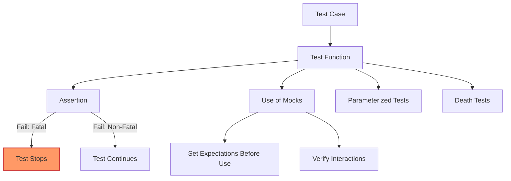

# Core Concepts & Terminology

GoogleTest is a comprehensive C++ testing framework, and understanding its core concepts and terminology is essential to unlocking its full potential. This page defines foundational testing terms such as *test cases*, *assertions*, *parameterized tests*, *death tests*, *mocks*, and the important distinction between *fatal* and *non-fatal* test failures. Equipped with this knowledge, you will confidently navigate the rest of the documentation and write effective tests.

---

## Why Core Concepts Matter

Imagine preparing to write a test suite for your C++ project. Before you draft a line of code, you need clarity on what a test case is, how to verify conditions properly, or when to use mocks for dependencies. Without this understanding, your tests may be brittle, unclear, or incomplete.

This page puts you in the driver’s seat. Starting here ensures that whether you are a beginner writing your first test or an experienced engineer exploring advanced features, you comprehend the language and building blocks GoogleTest uses to create robust, maintainable tests.

---

## Key Terminology Defined

### Test Case
A **test case** is a named logical unit that groups together related tests, otherwise known as **test functions** or **test methods**. Each test case targets a specific behavior or feature of the code under test.

### Test Function
A **test function** is an individual test within a test case — an isolated scenario that exercises a particular code path or input combination. GoogleTest treats test functions independently, reporting results per test.

### Assertion
An **assertion** verifies that a program state or expression satisfies an expected condition. GoogleTest distinguishes between:

- **Fatal assertions** (`ASSERT_` macros): stop execution of the current test function immediately upon failure.
- **Non-fatal assertions** (`EXPECT_` macros): report failures but continue execution within the test function.

Choosing between these determines whether your test continues checking further conditions after a failure or halts right away.

### Parameterized Tests
**Parameterized tests** allow you to run the same test logic multiple times with different input data. This approach avoids code duplication and ensures consistent coverage of variable inputs.

### Death Tests
**Death tests** verify that code terminates as expected (e.g., by crashing or exiting) under certain error conditions. They let you verify the program’s robustness and safety measures.

### Mocks
**Mocks** are substitute objects used in tests to simulate and control the behavior of dependencies. This allows you to test how your code interacts with collaborators without relying on their real implementations, which might be slow, unavailable, or non-deterministic.

GoogleTest integrates tightly with GoogleMock (gMock), enabling expressive mocks, expectation setting, and verification.

### Fatal vs Non-Fatal Failures
Failures from fatal assertions halt the current test immediately, preventing subsequent checks in that test from running. Non-fatal failures allow the test to continue running, accumulating error reports. Understanding this distinction helps tailor your tests’ flow and precision.

---

## Practical Examples

### Writing a Simple Test Function

```cpp
#include <gtest/gtest.h>

TEST(MathTest, AdditionWorks) {
  int sum = 2 + 2;
  EXPECT_EQ(sum, 4);  // Non-fatal assertion
  ASSERT_GT(sum, 3);  // Fatal assertion, stops on failure
}
```

This test verifies an addition operation. If `ASSERT_GT` fails, the test function stops immediately, avoiding further checks that might be invalid.

### Using Parameterized Tests

```cpp
class MyParamTest : public ::testing::TestWithParam<int> {};

TEST_P(MyParamTest, IsEven) {
  int n = GetParam();
  EXPECT_EQ(n % 2, 0);
}

INSTANTIATE_TEST_SUITE_P(EvenNumbers, MyParamTest, ::testing::Values(2, 4, 6, 8));
```

This runs the same test logic multiple times with even numbers as inputs.

### Applying Mocks

Suppose you have a `Turtle` interface and want to verify calls to `PenDown()`:

```cpp
MockTurtle turtle;
EXPECT_CALL(turtle, PenDown()).Times(AtLeast(1));
Painter painter(&turtle);
EXPECT_TRUE(painter.DrawCircle(0, 0, 10));
```

This test ensures the `PenDown()` method is called at least once during drawing.

---

## Practical Tips and Best Practices

- **Understand assertions’ impact**: Use fatal assertions when subsequent checks depend on critical conditions; use non-fatal assertions when you want comprehensive failure reports from a test.
- **Leverage parameterized tests**: They dramatically reduce redundancy and improve test coverage.
- **Use mocks to isolate tests**: Substitute real dependencies that might be slow, unreliable, or difficult to set up.
- **Order matters with mocks**: Set expectations *before* using mocks to avoid undefined behavior.
- **Manage failing tests**: Inspect assertion failure messages carefully to determine if the failure is a state error or an interaction error.

---

## Common Pitfalls

- **Mixing fatal and non-fatal assertions improperly**: This can cause tests to behave unpredictably or hide failures.
- **Over-specifying mocks**: Expecting exact call counts or argument matching too rigidly can make tests fragile.
- **Not providing virtual destructors**: Mocked interfaces must have virtual destructors to avoid memory leaks.
- **Running tests without setting expectations**: This can lead to uninteresting calls that generate warnings or missed failures.

---

## Navigating the Documentation

This foundational page connects with other parts of the documentation:

- [What is GoogleTest?](/overview/product-intro-core-concepts/what-is-googletest): High-level introduction to the framework.
- [Who Should Use GoogleTest?](/overview/product-intro-core-concepts/target-audience-use-cases): Understand if the tool fits your role and needs.
- [gMock for Dummies](docs/gmock_for_dummies.md): Learn how mocking fits with core concepts.
- [Writing and Structuring Basic Tests](/guides/getting-started/writing-basic-tests): Next steps to author real tests.
- [Assertions API](/api-reference/core-apis/test-assertions): Detailed reference of assertion macros.
- [Mocking Fundamentals](/api-reference/core-apis/mocking-core-api): Detailed guide on mocks.

---

## Summary

Understanding these core concepts and terminology unlocks the power of GoogleTest and GoogleMock. By mastering test case structure, assertion types, parameterized tests, death tests, and mocking, you will write clear, effective, and maintainable tests that accurately verify your C++ code’s correctness and behavior.

This page serves as your launchpad into deeper guides, API references, and real-world examples that follow.

---

<AccordionGroup title="Common Questions & Tips">
<Accordion title="What are fatal vs non-fatal assertions and when to use each?">
Fatal assertions (ASSERT_ macros) stop the current test function immediately upon failure, preventing further checks. Use these when later checks depend critically on early state. Non-fatal assertions (EXPECT_ macros) report failures but allow the test to continue, helping find multiple issues in one pass.
</Accordion>
<Accordion title="How should I organize tests with parameterized inputs?">
Parameterized tests let you write one test logic and re-run it with different inputs. This reduces duplication and improves coverage. Use TestWithParam base classes and INSTANTIATE_TEST_SUITE_P to supply different parameter sets.
</Accordion>
<Accordion title="When do I use mocks versus real objects?">
Mocks are ideal to isolate a unit test from external dependencies or slow, unreliable resources. Real objects may be used when dependencies are simple and stable. Using mocks can accelerate tests and detect interaction contract violations.
</Accordion>
</AccordionGroup>

---

## Related Diagrams



---

## Summary Table of Core Concepts

| Concept             | Description                                                  | User Benefit                         |
| ------------------- | ------------------------------------------------------------| -----------------------------------|
| Test Case           | Groups related tests                                         | Organizes tests logically           |
| Test Function       | Individual test scenario                                     | Isolates failure causes            |
| Assertion           | Checks expected conditions (fatal/non-fatal)                | Accurate verification flow controls|
| Parameterized Tests | Same test runs with variable inputs                          | Reduces redundancy, improves coverage|
| Death Tests         | Verifies expected program termination behavior              | Tests robustness and error handling|
| Mocks               | Substitute objects controlling interactions                  | Isolates unit, enables detailed interaction checks|

---

For more hands-on examples and advanced mocking techniques, explore the [gMock Cookbook](docs/gmock_cook_book.md) and [Mocking Reference](docs/reference/mocking.md).

Happy testing!