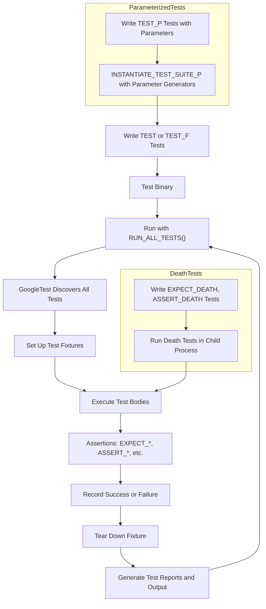

# Key Features and Workflows

GoogleTest delivers a comprehensive set of features that empower developers to write reliable, maintainable, and expressive tests for C++ code. This page offers a clear overview of GoogleTest’s essential capabilities and how they shape typical user workflows—guiding you from writing straightforward tests to orchestrating complex, parameterized test suites and integrating seamlessly into your build system.

---

## Core Feature Highlights

### 1. Rich Assertion Framework

At the heart of GoogleTest is a powerful assertion system that verifies code correctness with clear, informative feedback when things go wrong.

- **Variety of Assertions**: From simple boolean checks (`EXPECT_TRUE`, `ASSERT_FALSE`) to detailed binary comparisons (`EXPECT_EQ`, `ASSERT_NE`), GoogleTest offers assertions that precisely match your verification needs.
- **String and Floating-Point Support**: Specialized assertions help compare C strings, wide strings, and floating-point numbers with correct semantics and tolerances.
- **Custom Predicates and Matchers**: Extend assertions with predicates that produce meaningful failure messages, or leverage GoogleMock-style matchers (`EXPECT_THAT`) for fluent, readable verification.
- **Success and Failure Macros**: Document control flow explicitly with `SUCCEED()` and `FAIL()`, for scenarios where test outcomes depend on complex runtime logic.

### 2. Test Discovery and Execution

GoogleTest automates finding and running your tests without manual registration.

- **Simple Tests via `TEST` Macro**: Define independent tests with descriptive names grouped under test suites for logical organization.
- **Test Fixtures with `TEST_F`**: Share setup and teardown logic among related tests, improving reuse and architectural clarity.
- **Test Lifecycle Callbacks**: Use `SetUp()`, `TearDown()` for per-test initialization and cleanup, with `SetUpTestSuite()` and `TearDownTestSuite()` for expensive shared resources.
- **Automatic Test Registration**: No need for manual test enumeration—GoogleTest keeps track of your tests.
- **Filtering and Selective Runs**: Control which tests execute using filters or environment variables—ideal for quick debugging or CI pipelines.

### 3. Parameterized and Typed Tests

Write once, run many variations—parameterized and typed tests let you systematically validate code across diverse inputs and types.

- **Value-Parameterized Tests (`TEST_P`)**: Define tests that accept parameters for data-driven testing, activated by parameter generators like `Values()`, `Range()`, and `Combine()`.
- **Typed Tests (`TYPED_TEST`)**: Test templates instantiated over a list of types to verify behavior across multiple implementations.
- **Type-Parameterized Tests (`TYPED_TEST_P`)**: Define type-parameterized test logic, registered and instantiated later—supporting test reuse and extensibility.
- **Custom Naming Functions**: Generate readable test names for parameters and types, improving reporting clarity.

### 4. Death Tests for Robustness

Assert that your code handles fatal errors correctly by expecting it to terminate under specific conditions.

- **Death Assertions (`EXPECT_DEATH`, `ASSERT_DEATH`)**: Validate that operations cause process termination when preconditions or invariants are violated.
- **Control Execution Style**: Choose between fast or thread-safe death test modes to balance speed and reliability.
- **Comprehensive Matching**: Verify exit statuses, signals, and output messages with regex or matcher support.

### 5. Custom Test Event Listeners and Environments

Extend GoogleTest to integrate with your build or CI environment or customize test output.

- **Event Listener API**: Hook into test lifecycle events like test start, end, failure, and environment setup/teardown.
- **Global Environments**: Define global setup/teardown logic that runs once per entire test program.

### 6. Advanced Features and Balances

- **Assertions in Subroutines**: Handle fatal and non-fatal assertions cleanly within helper functions.
- **Scoped Diagnostic Traces (`SCOPED_TRACE`)**: Add contextual logging that automatically appears on test failures to aid debugging.
- **Exception Assertions**: Test exception throwing and catching where enabled.
- **Flexible Test Registration**: Register tests dynamically for advanced use cases.

---

## Typical User Workflow

### Writing Simple Tests

Using the `TEST` macro, start by defining focused, independent tests that verify basic behavior:

```cpp
TEST(FactorialTest, HandlesZeroInput) {
  EXPECT_EQ(Factorial(0), 1);
}

TEST(FactorialTest, HandlesPositiveInput) {
  EXPECT_EQ(Factorial(3), 6);
  EXPECT_EQ(Factorial(5), 120);
}
```

### Reusing Setup with Fixtures

When multiple tests share setup and teardown code, use test fixtures for cleaner, DRY tests:

```cpp
class QueueTest : public testing::Test {
protected:
  void SetUp() override {
    queue_.Enqueue(1);
  }
  Queue<int> queue_;
};

TEST_F(QueueTest, IsNotEmpty) {
  EXPECT_GT(queue_.size(), 0);
}

TEST_F(QueueTest, CanDequeue) {
  auto item = queue_.Dequeue();
  ASSERT_NE(item, nullptr);
  EXPECT_EQ(*item, 1);
}
```

### Expanding Coverage with Parameterized Tests

Test multiple input permutations with one definition:

```cpp
class IsEvenTest : public testing::TestWithParam<int> {};

TEST_P(IsEvenTest, ReturnsTrueForEvenNumbers) {
  EXPECT_TRUE(IsEven(GetParam()));
}

INSTANTIATE_TEST_SUITE_P(EvenNumbers, IsEvenTest, testing::Values(2, 4, 6, 8));
```

### Leveraging Death Tests

Validate that your code properly aborts on invalid states:

```cpp
TEST(MyDeathTest, FailsOnNullPointer) {
  ASSERT_DEATH(FunctionUnderTest(nullptr), "Null pointer error");
}
```

### Integrating and Extending

Use the event listener API for reporting customization, and define global environments for complex set up:

```cpp
class MyEnv : public testing::Environment {
 public:
  void SetUp() override { InitializeDatabase(); }
  void TearDown() override { CleanupDatabase(); }
};

int main(int argc, char** argv) {
  testing::InitGoogleTest(&argc, argv);
  testing::AddGlobalTestEnvironment(new MyEnv);
  return RUN_ALL_TESTS();
}
```

---

## Practical Tips and Best Practices

- Use `ASSERT_*` macros when a failure should abort the current test function immediately, ensuring no further unsafe operations occur.
- Prefer `EXPECT_*` macros when you want tests to continue after failures for comprehensive failure reports.
- Avoid underscores (`_`) in test suite and test names to prevent naming issues in generated code.
- For parameterized tests, always provide unique instantiation names and meaningful parameter suffixes.
- Use `SCOPED_TRACE` for adding relevant context when invoking shared test subroutines.
- When writing death tests, minimize threading conflicts by restricting thread creation outside of death assertions.
- Register global environments early, preferably in your custom `main()`, to ensure proper lifecycle management.

---

## Troubleshooting Common Issues

<AccordionGroup title="Common Pitfalls and Resolutions">
<Accordion title="Why does my test fixture fail to compile with no default constructor?">
Ensure your fixture class defines a public default constructor, especially if you declared other constructors. GoogleTest requires the default constructor to instantiate tests.
</Accordion>
<Accordion title="My death test hangs or crashes unexpectedly. How do I fix this?">
Death tests run in child processes and can be sensitive to threads and state. Avoid creating threads outside death tests and minimize side-effects inside them. Use the "threadsafe" death test style if needed.
</Accordion>
<Accordion title="Why are underscores prohibited in test names?">
Underscores cause ambiguous generated class names due to internal naming patterns. Avoid them to prevent compilation or runtime errors.
</Accordion>
<Accordion title="Assertion macros won't compile inside constructors or destructors. Why?">
`ASSERT_*` and `FAIL()` macros only work in void-returning functions, and virtual dispatch is limited in constructors/destructors. Use `SetUp()`/`TearDown()` for such logic.
</Accordion>
</AccordionGroup>

---

## Diagram: Simplified GoogleTest Workflow



---

## Next Steps

To get started with GoogleTest, explore the following documentation pages:

- [What is GoogleTest?](/overview/product-intro-core-value/what-is-googletest) — for foundational understanding.
- [Getting Started Guide](/getting-started/prerequisites-installation/initial-configuration) — for setup and your first test.
- [Assertions Reference](/reference/assertions) — to master assertion macros and their uses.
- [Parameterized and Typed Tests](/guides/core-workflows/parameterized-testing) — to deepen your test coverage techniques.


---

GoogleTest brings clarity, productivity, and robustness to your testing workflows—all while supporting advanced testing scenarios and integration modes to suit your evolving development needs.


---