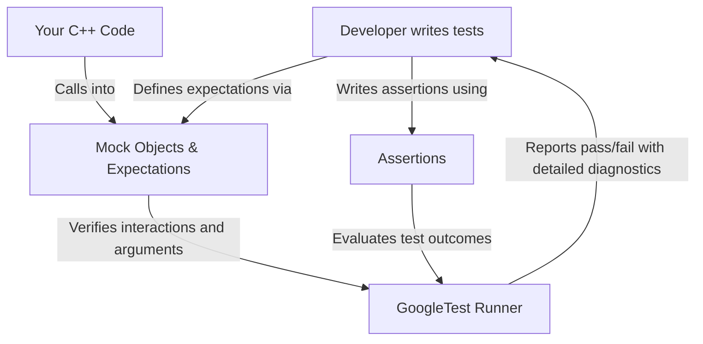

# GoogleTest Value Proposition

## Unlocking Reliability, Speed, and Maintainability in C++ Testing

GoogleTest (often called gTest) is more than just a C++ testing framework — it's a comprehensive toolset engineered to bring clarity, efficiency, and confidence to your testing efforts. Designed by Google experts with deep knowledge of C++ testing challenges, GoogleTest accelerates development by empowering you to write tests that are easy to maintain, provide fast feedback, and thoroughly verify your code.

### What GoogleTest Brings to Your Development Process

- **Reliable and Maintainable Tests:** Enables writing tests that capture meaningful behaviors and prevent regressions, fostering long-term code health.
- **Accelerated Development Cycles:** Quick test execution and simple syntax let you iterate rapidly and catch issues early.
- **Support for Multiple Testing Patterns:** From unit testing to integration and system-level testing, GoogleTest adapts to your needs and scales with your project.
- **Comprehensive Assertion and Mocking Support:** Offers expressive assertions and a powerful mocking framework to isolate components and verify interactions precisely.

Unlike generic test frameworks, GoogleTest is tailored specifically for C++ — honoring its language idiosyncrasies and empowering you with idiomatic, expressive capabilities unique to this ecosystem.

## What GoogleTest Does

At its core, GoogleTest helps you write automated tests that verify your C++ code behaves as expected. It solves the pervasive problem of brittle or slow tests by providing:

- A rich set of assertion macros to verify conditions in your code with clear, detailed diagnostics.
- Flexibility to verify both the correctness and interactions of your code through test fixtures, parameterized tests, and mocking.
- Support for various testing styles — state-based, interaction-based, or hybrid — to suit your design and verification goals.

By doing so, GoogleTest enables maintainable code bases where issues are caught quickly, bugs are prevented from creeping in, and confidence in code changes is dramatically increased.

## How GoogleTest Supports Critical Outcomes

### Maintainable Code
By providing clear, precise, and expressive assertions alongside robust mock object support, GoogleTest encourages designing interfaces and modular components that are inherently more testable and less coupled. This leads to cleaner, more maintainable code reflecting actual design intent and contract.

### Fast Feedback Cycles
GoogleTest’s lightweight approach and optimized test runner make it feasible to run tests frequently — even after small changes. Fast feedback promotes iterative development and reduces latency between writing code and discovering issues.

### Versatility in Test Patterns
No matter if you're verifying a single class's logic (unit test), interactions across components (integration test), or your entire system behavior (system test), GoogleTest supports the full spectrum. It adapts cleanly to different workflows and scales from simple to complex scenarios.


## Real-World Example of GoogleTest Delivering Value

Consider a graphics application that depends heavily on a drawing API. Without testing infrastructure, verifying drawing logic is laborious and error-prone. By designing against interfaces and employing mocks generated by GoogleTest, you can precisely verify drawing interactions:

```cpp
class MockTurtle : public Turtle {
 public:
  MOCK_METHOD(void, PenUp, (), (override));
  MOCK_METHOD(void, PenDown, (), (override));
  MOCK_METHOD(void, Forward, (int distance), (override));
  MOCK_METHOD(void, Turn, (int degrees), (override));
  MOCK_METHOD(void, GoTo, (int x, int y), (override));
  MOCK_METHOD(int, GetX, (), (const, override));
  MOCK_METHOD(int, GetY, (), (const, override));
};

TEST(PainterTest, DrawsCircle) {
  MockTurtle turtle;
  EXPECT_CALL(turtle, PenDown()).Times(AtLeast(1));
  Painter painter(&turtle);
  EXPECT_TRUE(painter.DrawCircle(0, 0, 10));
}
```

This test is fast, reliable, and focused on verifying interaction patterns rather than rendering outputs, fostering maintainability and developer productivity.

## Progressive Mastery: Starting and Growing With GoogleTest

GoogleTest invites developers from beginners to experts to evolve their testing practices organically. Start with straightforward assertions and basic mocks, then employ sequences, cardinalities, custom matchers, and actions to express intricate expectations as your needs advance. Its intuitive DSL and comprehensive documentation ensure that learning curve friction is minimized.

## Tips for Maximizing GoogleTest’s Benefits

- Prefer specifying only necessary expectations to avoid brittle tests.
- Use `ON_CALL` to set behaviors without imposing call expectations.
- Combine `EXPECT_CALL` with sequences to enforce call order when needed.
- Leverage mocking to isolate units while verifying interactions.
- Regularly run tests via automated pipelines to ensure quality.

## Common Pitfalls to Avoid

- Overconstraining tests with excessive or overly strict expectations.
- Ignoring unhandled mock behaviors leading to warnings or silent acceptance of unexpected calls.
- Running tests with insufficient verbosity when diagnosing failures.
- Writing brittle tests that break on innocuous refactors.

## Conclusion

GoogleTest is a purpose-built C++ testing framework that goes beyond simple assertions. It delivers critical business and technical value by enabling maintainable and reliable tests, accelerating development with fast feedback loops, and supporting diverse test patterns. Its design reflects deep understanding of user needs and real-world C++ challenges, making it an essential tool for teams serious about quality and productivity.

---

### Next Steps

To build on this understanding, explore:

- [What is GoogleTest?](overview/product-intro-core-value/what-is-googletest) — Deep dive into GoogleTest’s origins and core capabilities.
- [Getting Started Guide](overview/integration-and-getting-started/quickstart-resources) — How to set up and write your first tests.
- [Mocking Reference](api-reference/mocking-apis/mock-methods) — Leverage mocks and expectations to test interactions precisely.

You might also find practical recipes and troubleshooting tips in the [gMock Cookbook](guides/mocking-best-practices/mocking-patterns) invaluable.


---

## Additional Resources

- [GoogleTest Official GitHub Repository](https://github.com/google/googletest)
- [gMock for Dummies](docs/gmock_for_dummies.md) — Beginner-friendly guide to mocking
- [Actions Reference](docs/reference/actions.md) — Define behaviors of mocked methods
- [Assertions Reference](docs/reference/assertions.md) — Rich assertions to capture validation


#### Diagram: Value Flow in GoogleTest


This simple workflow illustrates how GoogleTest integrates test expectations and assertions into a seamless developer feedback loop.
