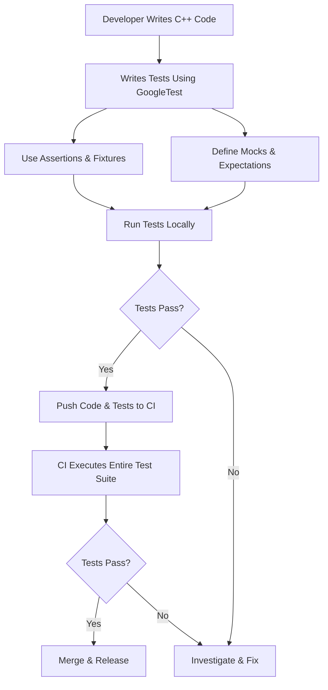

# Target Audience & Use Cases

## Understanding Who Benefits from GoogleTest

GoogleTest is tailored specifically for C++ developers and testing engineers focused on crafting reliable, maintainable software through automated testing. This page defines the primary audiences who gain the most from GoogleTest and describes the variety of testing scenarios it addresses, helping users understand where and how to apply the framework effectively.


## Who Is GoogleTest For?

- **C++ Developers:** Whether building small components or complex systems, developers writing and maintaining C++ code rely on GoogleTest to verify that their code works correctly and to catch regressions early.
- **Automated Testing Engineers:** Professionals tasked with designing and maintaining test suites will find GoogleTest’s rich assertion library, test discovery, and mocking features invaluable for creating thorough and maintainable tests.
- **Organizations:** Companies and teams aiming for robust software quality, increased confidence in releases, and easier maintenance benefit from GoogleTest’s ability to support project-wide regression testing and integration into continuous integration pipelines.


## Typical Testing Scenarios Addressed by GoogleTest

GoogleTest is designed to scale across a wide range of testing needs, from simple component verification to comprehensive regression suites:

### 1. Individual Component Testing

- **Goal:** Verify the correctness of a single class or function.
- **How GoogleTest Helps:** Enables developers to write focused unit tests quickly, using an expressive assertion framework to validate logic paths, edge cases, and expected outputs.
- **Example:** Testing a complex algorithm for numerical stability or correctness of string manipulation methods.

### 2. Interaction-Based Testing with Mocks

- **Goal:** Validate that modules communicate properly without requiring full dependencies.
- **How GoogleTest Helps:** Integrated GoogleMock enables writing mock classes that simulate collaborators’ behaviors to verify interactions, call orders, and argument correctness.
- **Example:** Testing a network client by mocking the server connection to check if connection retries occur as expected.

### 3. Parameterized and Typed Tests

- **Goal:** Test the same logic across multiple data sets or types without duplicating code.
- **How GoogleTest Helps:** Provides mechanisms for parameterized and typed tests to reuse test logic efficiently, ensuring comprehensive coverage across variants.
- **Example:** Testing a template container class with various primitive and user-defined types.

### 4. Regression and Integration Testing

- **Goal:** Guard the entire codebase’s stability after changes.
- **How GoogleTest Helps:** Supports discovery and execution of large test suites, enabling project-wide regression tests that run automatically, reducing release risk.
- **Example:** Running thousands of tests nightly to catch regressions caused by recent commits.

### 5. Error Handling and Death Tests

- **Goal:** Confirm that software behaves correctly in failure or exceptional conditions.
- **How GoogleTest Helps:** Facilitates writing tests for error paths, including verifying proper termination behaviors using death tests.
- **Example:** Testing that a utility aborts on invalid input as intended.


## Advanced Uses and Benefits

GoogleTest’s flexible architecture also supports:

- **Continuous Integration:** Easily integrated into automated build and test pipelines, enabling fast feedback on code changes.
- **Cross-Platform Consistency:** Works across a variety of platforms and compilers, ensuring tests behave consistently in different environments.
- **Test Maintenance:** Features like sequences, expectation ordering, and rich diagnostics improve maintainability and debuggability of complex test suites.


## Before and After Using GoogleTest

| Scenario                        | Without GoogleTest                          | With GoogleTest                           |
| -------------------------------| -------------------------------------------| -----------------------------------------|
| Writing tests                  | Manual, ad hoc, error-prone, often skipped | Automated with repeatable frameworks and rich diagnostics |
| Catching regressions           | Difficult, error prone                      | Early detection through continuous runs |
| Validating interactions       | Difficult or using manual test doubles     | Easy with built-in mocking and expectations |
| Maintaining test suites       | Labor intensive and fragile                 | Structured, organized, and extensible   |


## Real-World Use Cases

- **Development of Libraries:** Developers building reusable C++ libraries use GoogleTest to ensure backward-compatible API behavior and correctness.
- **Embedded Systems:** Testing hardware abstraction layers where hardware interaction is mocked.
- **Enterprise Systems:** Large scale projects rely on GoogleTest for ongoing quality assurance and integration testing.


## Getting Started with GoogleTest as Your Testing Partner

To begin applying GoogleTest to your projects, you typically:

1. Install GoogleTest and set it up in your build system (see "Installation with CMake" or "Installation with Bazel").
2. Define test cases and fixtures concentrating on your components (refer to "Writing and Running Your First Test").
3. Leverage mocking capabilities to simplify complex dependencies (see "Introduction to Mocking" and "Specifying Expectations and Actions").
4. Expand tests to cover broader use cases such as parameterized tests and death tests.


For detailed guidance on these steps, refer to the [Getting Started](../../getting-started) and [Guides](../../guides) sections.


---

### Practical Tips for Success

- Use mocking to isolate components, avoid external dependencies in tests.
- Prefer `EXPECT_CALL` to specify interactions explicitly and verify behavior.
- Employ sequences or `InSequence` objects to verify call order when important.
- Use parameterized tests to avoid duplicate code and improve coverage.
- Regularly run large test suites automatically to catch regressions early.


<AccordionGroup title="Common Pitfalls and Troubleshooting">
<Accordion title="Strict vs Nice vs Naggy Mocks">
Understand that by default, mocks are "naggy," issuing warnings when unexpected calls are made. Use `NiceMock` to suppress such warnings when appropriate, or `StrictMock` to enforce stricter checking. Refer to the [Nice, Strict, and Naggy](../../docs/gmock_cheat_sheet.md#NiceStrictNaggy) documentation for details.
</Accordion>
<Accordion title="Order of EXPECT_CALL and Calls">
EXPECT_CALL expectations must be set before exercising code that invokes mocks to avoid undefined behavior. The framework matches calls starting from the most recent expectations. Use sequences if call order matters.
</Accordion>
<Accordion title="Mocking Non-virtual Methods">
GoogleMock does not mock non-virtual methods by default. Use templates or redesign your code to test with interfaces.
</Accordion>
</AccordionGroup>


---

# Example: Simple Mock Usage

```cpp
#include <gmock/gmock.h>
#include <gtest/gtest.h>

class Foo {
 public:
  virtual ~Foo() {}
  virtual int GetValue() = 0;
};

class MockFoo : public Foo {
 public:
  MOCK_METHOD(int, GetValue, (), (override));
};

TEST(FooTest, ReturnsExpectedValue) {
  MockFoo mock_foo;
  EXPECT_CALL(mock_foo, GetValue())
      .Times(1)
      .WillOnce(testing::Return(42));

  int val = mock_foo.GetValue();
  EXPECT_EQ(val, 42);
}
```


---

## Diagram: Typical GoogleTest Use Flow




---

## Next Steps

Explore related documentation pages to deepen your understanding:

- [What is GoogleTest?](../product-intro-value/what-is-googletest)
- [Core Features at a Glance](../product-intro-value/core-features-at-a-glance)
- [Introduction to Mocking](../../guides/mocking-and-behavior-verification/introduction-to-mocking)
- [Writing and Running Your First Test](../../getting-started/configuration-bootstrap/first-test-case)


<Callout>
Remember, well-structured tests written with the right expectations provide invaluable confidence and ease maintenance drastically. GoogleTest brings you the tools to achieve this at scale.
</Callout>
