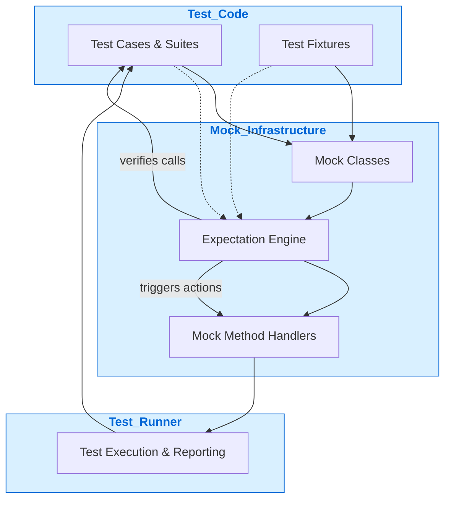

# System Architecture Overview

GoogleTest and GoogleMock form a powerful, unified C++ testing framework that enables developers to write and run tests with clear control over dependencies and interactions. This page presents a visual summary of the major components within the GoogleTest and GoogleMock ecosystem, illustrating their relationships and the data flows that make testing both expressive and efficient.

## Overview: Visualizing the Unified Testing Design

At its core, the GoogleTest and GoogleMock framework integrates three primary components:

- **Test Code**: Your unit tests and test fixtures that express what behavior you expect from your code under test.
- **Mock Infrastructure**: The GoogleMock-generated mock classes and supporting runtime components that enforce expectations, simulate dependencies, and monitor function call behaviors.
- **Test Runner**: The GoogleTest executable environment that loads, runs, and reports the results of your tests.

This architecture enables seamless interaction between your tests and mocking logic, ensuring that expectations are checked automatically as tests run, and that feedback is immediately provided on any violations.

### Mermaid Diagram Illustrating the Architecture

## Components Explained

### Test Code
This is where your actual test cases, test suites, and test fixtures live. Test code:

- Defines the *what*: the behavior you expect from the code under test.
- Instantiates mock objects (via Mock Classes) to replace real dependencies.
- Invokes code that uses mocks, relying on mocks to validate interactions.

### Mock Infrastructure
This component forms the magic behind GoogleMock, turning your mock class declarations into fully functional runtime mocks. It includes:

- **Mock Classes**: Auto-generated classes that implement the interfaces you define for mocking.
- **Expectation Engine**: Tracks what calls are expected, their arguments, order, and frequency.
- **Mock Method Handlers**: The code that intercepts calls to mocked methods and enforces expectations.

This infrastructure automatically verifies that behavior complies with test expectations, reporting failures as soon as they occur.

### Test Runner
The executor that runs all tests, this component:

- Discovers test cases and suites.
- Runs each test, invoking test code and the mock infrastructure.
- Collects results, verifies expectations, and reports successes and failures.

Its functionality ensures your testing feedback cycle is fast, clear, and comprehensive.

## How Components Interact: Walkthrough

1. **Setup**: Test code defines test cases with mock object usage.
2. **Execution Start**: Test runner begins running selected tests.
3. **Mock Method Calls**: Your code under test calls mocked methods.
4. **Expectation Checks**: Mock infrastructure intercepts each call and validates it against set expectations.
5. **Action Execution**: If expected, corresponding actions (return values, side effects) occur.
6. **Result Reporting**: Test runner collects success/failure info and reports.

This flow ensures tight control of how code interacts with dependencies and that any breach of contract is immediately flagged.

## Real-World Example Scenario

Imagine you are testing a networking module that depends on a connection interface:

- You define a mock `Connection` class using GoogleMock.
- Your test sets the expectation that `Send()` will be called exactly twice with certain arguments.
- When your code calls `Send()`, the mock intercepts the calls, verifies argument correctness, and tracks call counts.
- If your code calls `Send()` more or less than twice or with unexpected arguments, GoogleMock reports a failure.
- The test runner aggregates this feedback, helping you quickly identify issues.

This architecture elegantly separates concerns while providing rich diagnostics.

## Best Practices

- Always define expectations *before* exercising the code under test to enable immediate failure detection.
- Use mock infrastructure to simplify handling of complex dependencies and to check precise interactions.
- Combine sequences or partial ordering (`InSequence`, `Sequence`) to verify interaction order when necessary.
- Utilize the test runner’s reporting to rapidly triage failing tests.

## Troubleshooting

- If expectations are not being enforced, ensure that mocks are not leaked and that test runner completes test execution.
- Verify that mock methods are declared correctly with `MOCK_METHOD` macros.
- Use verbose logging flags like `--gmock_verbose=info` during test runs to get detailed call traces.

## Next Steps

For detailed guidance on defining your mock classes and setting expectations, see the [What is GoogleTest & GoogleMock?](overview/product-intro/what-is-googletest) page. To explore how core mocking APIs work, consult the API Reference sections related to expectations and mock behaviors. For an in-depth understanding of the testing workflows and advanced mocking patterns, visit the guides and cookbook documentation.

---

_Return to [Overview and Fundamentals](overview/product-intro) or proceed to [Core Concepts & Terminology](overview/product-intro/core-concepts-terminology) for foundational knowledge._