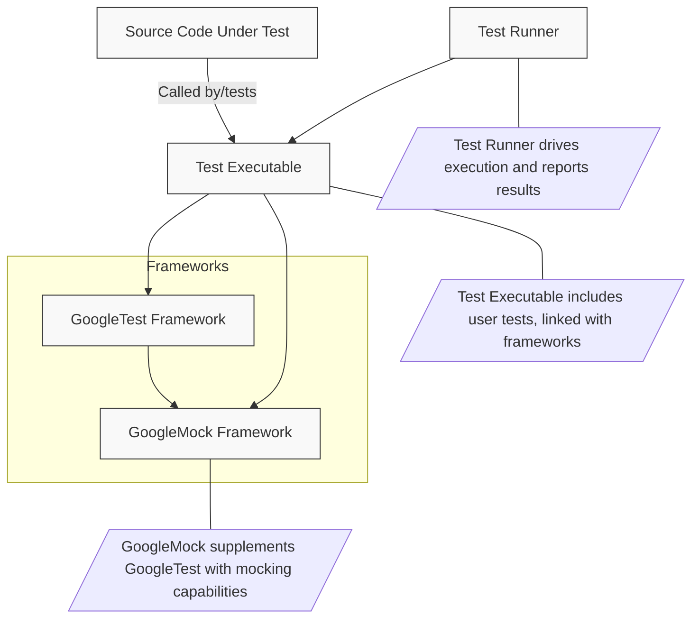

# System Architecture Overview

## Introduction

This page provides a comprehensive view of the **GoogleTest** and **GoogleMock** system architecture. It connects the various components from the source code to test execution, showing how the modular design supports extensibility, clarity, and usability. With an illustrative Mermaid diagram, new users can visualize the core building blocks, their interactions, and the flow of test requests through the system.

Understanding this architecture will help you grasp how GoogleTest and GoogleMock operate together to enable robust C++ testing and mocking capabilities.

---

## Core Components and Their Roles

- **Source Code Under Test**: Your application or library code that you want to test.
- **Test Executables**: Compiled test binaries that link your source code, GoogleTest, and GoogleMock.
- **GoogleTest Framework**: Responsible for managing test discovery, execution, assertions, and reporting.
- **GoogleMock Framework**: Provides facilities for creating mock classes, setting expectations, performing argument matching, and defining mock behaviors.
- **Test Runner**: Launches test executables, orchestrates individual tests, and collects results.

These components are arranged in a layered fashion where tests drive the behavior of mocks, which in turn simulate complex interactions within your application.

---

## System Flow

Users write tests using GoogleTest macros and utilize GoogleMock features within those tests. When tests are executed:

1. **Test Execution Starts** from the test driver (main function), which initializes GoogleTest and GoogleMock.
2. **Test Discovery** locates all registered tests.
3. **Tests Run** one by one:
   - Real objects or mocks are created.
   - Expectations and default behaviors are set on mocks.
   - The tested code under test is exercised.
   - GoogleMock verifies that expectations were met upon mock object destruction.
4. **Results Are Collected and Reported** showing pass/fail outcomes and detailed diagnostics.

---

## Architecture Diagram

---

## Design Principles

- **Modularity**: GoogleTest and GoogleMock are separate but complementary, allowing focused development and optional mocking.
- **Extensibility**: Users can extend GoogleMock with custom matchers and actions.
- **Simplicity in Usage**: Intuitive macros and APIs let users describe expectations and behaviors declaratively.
- **Robustness**: Automatic verification and detailed failure reporting enable effective debugging.
- **Integration**: Seamlessly integrates within test executables and supports common build systems.

---

## Summary

This architecture overview orients new users with the fundamental structure and workflow of the GoogleTest and GoogleMock system. By understanding component roles and the test execution flow, developers can better design tests, write mocks, and debug effectively.

## Next Steps

- Explore the [What is GoogleTest?](./what-is-googletest) page for a foundational introduction.
- Learn detailed usage of mocks in [Mocking Basics: Creating and Using Mocks](../../googletest-guides/advanced-mocking/mocking-basics).
- Dive into practical examples and common patterns in the [gMock Cookbook](../gmock_cook_book.md).
- Understand core test writing workflows in [Core Testing Workflows](../../googletest-guides/writing-and-running-tests/core-testing-workflows).

---

<PageFeedback>Have feedback on this page? Please contribute or suggest improvements on the <a href="https://github.com/google/googletest">GoogleTest GitHub repository</a>.</PageFeedback>
