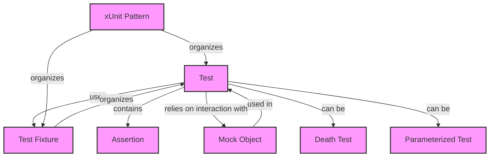

# Core Concepts & Terminology

Welcome to the foundational guide for GoogleTest users. This page unfolds the key concepts you'll encounter when writing and understanding tests in GoogleTest and GoogleMock. Mastering these terms will empower you to write effective tests and follow documentation with confidence.

---

## Tests

At the heart of GoogleTest are **tests** — individual pieces of code that exercise your program and verify that it behaves correctly. Each test checks one particular behavior or feature.

### What tests do:

- Validate that your code returns expected results.
- Ensure your code handles error conditions properly.
- Confirm internal logic works as intended.

Tests are organized into test cases or test suites, grouping similar tests for better management and reporting.

---

## Assertions

Assertions are the *checks* inside tests. They specify conditions that must hold true for the test to pass. When an assertion fails, the test fails immediately or continues depending on the assertion type.

### Key points about assertions:

- They compare actual program output to expected values.
- Provide detailed messages on failure for debugging.
- Types include simple condition checks, equality, exception throwing, and others.

Example:

```cpp
EXPECT_EQ(calculated_value, expected_value);  // Passes if both values match
ASSERT_TRUE(pointer != nullptr);             // Aborts the test if pointer is null
```

---

## Test Fixtures

Test fixtures provide a reusable setup for tests that share common objects or state. Instead of repeating setup code in each test, you define a fixture class.

### Benefits of test fixtures:

- Organize tests with shared context.
- Manage common initialization and cleanup.
- Facilitate writing parameterized tests.

Example:

```cpp
class DatabaseTest : public ::testing::Test {
 protected:
  void SetUp() override {
    db.Connect();
  }
  void TearDown() override {
    db.Disconnect();
  }

  Database db;
};

TEST_F(DatabaseTest, QueryReturnsCorrectResult) {
  EXPECT_EQ(db.Query("SELECT * FROM Users"), expected_results);
}
```

---

## Mock Objects

Mocks are specially crafted objects that simulate and verify interactions between your code and its dependencies. GoogleMock extends GoogleTest to support mocks.

### Why use mocks?

- Test the *interaction* between components precisely.
- Replace complex or unavailable dependencies during testing.
- Control and observe the behavior of dependent components.

Mocks allow you to define expectations such as which methods should be called, with what arguments, how many times, and what they should return.

### Example:

```cpp
class MockTurtle : public Turtle {
 public:
  MOCK_METHOD(void, PenDown, (), (override));
  MOCK_METHOD(void, Forward, (int distance), (override));
};

TEST(DrawerTest, DrawsCircle) {
  MockTurtle turtle;
  EXPECT_CALL(turtle, PenDown());
  EXPECT_CALL(turtle, Forward(100));

  Drawer drawer(&turtle);
  drawer.DrawCircle();
}
```

---

## Death Tests

Death tests verify that your program aborts or terminates under certain conditions, for example, catching assert failures or fatal errors.

They run the tested code in a subprocess to isolate the termination and verify the cause.

### Usage Example:

```cpp
EXPECT_DEATH({
  MyObject obj;
  obj.Crash();
}, "Fatal error triggered");
```

Death tests help validate robust error handling and fail-fast scenarios.

---

## Parameterized Tests

Parameterized tests enable running the same test logic with different input data.

### Benefits:

- Avoid repetitive test code.
- Easily verify behavior across a range of inputs.

Example:

```cpp
class FactorialTest : public ::testing::TestWithParam<int> {};

TEST_P(FactorialTest, ComputesCorrectFactorial) {
  int n = GetParam();
  EXPECT_EQ(Factorial(n), expected_values[n]);
}

INSTANTIATE_TEST_SUITE_P(
    FactorialTests,
    FactorialTest,
    ::testing::Values(1, 2, 3, 4, 5));
```

---

## xUnit Patterns

GoogleTest follows the xUnit testing framework pattern that organizes tests primarily through:

- **Fixtures:** Test contexts with setup and teardown.
- **Test Cases/Suites:** Group related tests.
- **Test Methods:** Individual tests within suites.

Using xUnit patterns promotes consistency and leverages familiar test management workflows.

---

## Summary of Concepts

| Concept            | Purpose / Description                                   |
| ------------------ | -------------------------------------------------------- |
| **Test**           | An executable that verifies a discrete piece of code behavior |
| **Assertion**      | A statement in tests that validates conditions          |
| **Test Fixture**   | A reusable setup and teardown context for tests          |
| **Mock Object**    | A controllable stand-in for dependencies verifying interaction |
| **Death Test**     | A test ensuring the program terminates as expected      |
| **Parameterized Test** | A test that runs repeatedly over varied inputs       |
| **xUnit Pattern**  | A framework for organizing tests based on fixtures and cases |

---

## Practical Tips

- Always write assertions that specify expected outcomes clearly.
- Use test fixtures to avoid duplicating setup/teardown code.
- Apply mocks to isolate your unit under test and inspect its interactions.
- Use death tests for verifying fail-fast scenarios.
- Use parameterized tests to cover more cases with less code.
- Follow the xUnit patterns for consistent test organization.

---

## Next Steps

After understanding these key terms, you are ready to explore detailed guides such as:

- [Writing Your First Test](/getting-started/first-test-execution/writing-your-first-test)
- [Assertions and Best Practices](/googletest-guides/writing-and-running-tests/assertions-and-best-practices)
- [Mocking Basics](/googletest-guides/advanced-mocking/mocking-basics)

Well-structured tests following these concepts will lead to maintainable and robust software testing.

---

## Additional Resources

- [GoogleTest Primer](overview/product-intro/what-is-googletest)
- [Assertions Reference](docs/reference/assertions.md)
- [gMock Cookbook](docs/gmock_cook_book.md)
- [Mocking Reference](docs/reference/mocking.md)

Embrace these core concepts to boost your testing proficiency with the GoogleTest and GoogleMock frameworks.

---

# Diagram: Core Concepts Relations



---