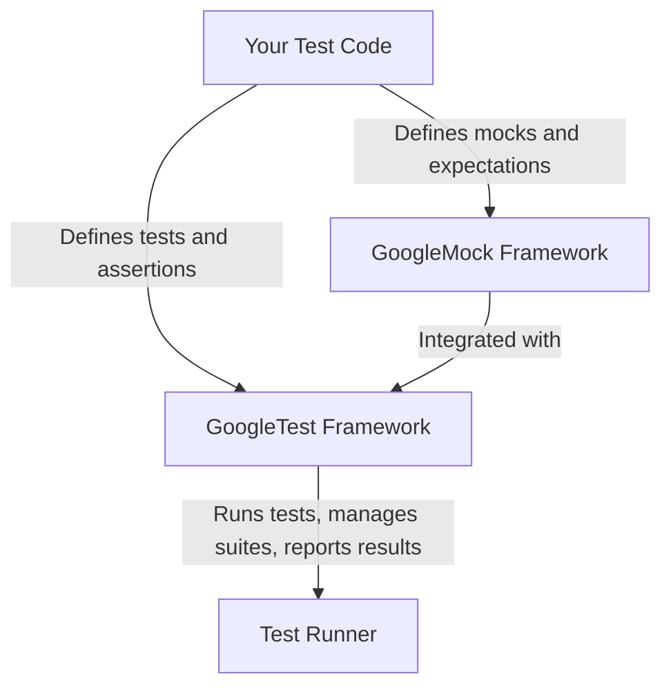

# What is GoogleTest and GoogleMock?

## Introducing GoogleTest and GoogleMock: Reliable C++ Testing Frameworks from Google

### Empowering Developers to Write Robust and Maintainable Unit Tests

GoogleTest and GoogleMock are Google's premier C++ testing and mocking frameworks designed to help developers write tests that are reliable, maintainable, and easy to understand.

They embody a strong commitment to quality through applying proven testing principles, making your code safer and your development process more efficient.

- **Unified Framework:** GoogleTest and GoogleMock have merged into a single, cohesive project, simplifying setup and usage for a streamlined testing experience.
- **xUnit-Based Model:** Inspired by the widely adopted xUnit architecture familiar from tools like JUnit and PyUnit, GoogleTest supports structured, independent, and repeatable tests.
- **Cross-Platform Compatibility:** Whether on Linux, Windows, or Mac, the frameworks run smoothly, supporting diverse development environments.
- **Declarative Mocking Syntax:** GoogleMock enables creation of mock classes with declarative syntax and expressive matchers, making it easy to simulate and verify behavior.

This page explores the origins, guiding philosophy, and integrated approach of GoogleTest and GoogleMock, showing how they empower developers to build better C++ tests.

---

## What Are GoogleTest and GoogleMock?

GoogleTest is a C++ testing framework developed with Google's internal requirements but openly available for any C++ development. Its primary goal is to allow developers to write tests that verify code correctness while being organized, efficient, and informative.

GoogleMock complements GoogleTest by offering a powerful mocking framework for C++ classes and functions. It helps developers simulate dependencies and verify interactions, facilitating thorough isolated unit tests and better design.

Together, they form a comprehensive testing solution for C++ projects.

---

## Core Purpose and Philosophy

### Solving Fundamental Testing Challenges

- **Isolation & Repeatability:** Tests are designed to run independently and consistently regardless of order or environment, making debugging easier.
- **Organization:** Grouping related tests into suites reflects your code architecture, enabling maintainable and understandable test structures.
- **Portability:** GoogleTest and GoogleMock work seamlessly across multiple operating systems and compiler configurations.
- **Informative Failures:** On failure, you get detailed diagnostics including file, line number, and descriptive messages without halting remaining tests.
- **Developer-Focused Automation:** The frameworks handle housekeeping, such as automatic test registration and resource management, so you focus on meaningful assertions.

### Why The xUnit Model?

The frameworks are grounded in the xUnit testing pattern, which provides a familiar and proven structure for unit testing:

- Each test is a small function that uses assertions to verify behavior.
- Tests are grouped into test suites for logical coherence and reuse of test fixtures.
- Test fixtures let you set up and tear down shared data efficiently.

This approach ensures clarity and scalability, whether testing a simple function or a complex class.

---

## Key Differentiators of GoogleTest and GoogleMock

- **Integrated Mocking and Testing:** Unlike many frameworks that require separate tools for mocks, GoogleTest includes GoogleMock, offering seamless transitions between testing and mocking.
- **No Exceptions Needed:** GoogleMock avoids exception use to maintain compatibility and minimize overhead, supporting environments where exceptions are disabled.
- **Rich Matchers and Actions:** GoogleMock offers an extensive library of matchers for argument validation and actions to define mock behaviors declaratively.
- **Automatic Expectation Verification:** GoogleMock verifies that expected calls happen without complicated record-replay cycles.
- **Flexible Test Registration:** GoogleTest supports dynamic test registration as well as macros, facilitating data-driven and parameterized tests.

Together, these features reduce boilerplate, improve test clarity, and speed up development.

---

## How They Work Together

In practice, GoogleTest provides the core testing infrastructure, running tests with assertions, organizing suites, and reporting results.

GoogleMock builds on top by allowing you to define mock classes and expectations. When you write tests with GoogleMock:

1. Define mock classes with `MOCK_METHOD` macros specifying mocked member functions.
2. Use `EXPECT_CALL` to set expectations and desired behaviors on those mock methods.
3. Run tests under GoogleTest, which automatically verifies that mock expectations are met.

This integration means you don’t need separate frameworks or complex workflows when needing mocks in your tests.

<Info>
GoogleMock is distributed as part of the GoogleTest repository, ensuring compatibility and shared evolution.
</Info>

---

## Brief Project History

GoogleTest originated as an internal framework created by Google's Testing Technology team to meet demanding requirements for reliability and maintainability in testing vast C++ codebases.

GoogleMock was introduced later to handle mocking needs with C++ nuances in mind.

The two projects have since merged into a single repo, simplifying adoption and ensuring that innovations benefit both parts equally.

---

## Summary

GoogleTest and GoogleMock together deliver a powerful, flexible foundation for C++ testing:

- Familiar xUnit architecture with extensive support for fixtures, assertions, and test organization.
- Comprehensive and intuitive mocking capabilities tailored for C++.
- Cross-platform support, rich diagnostics, and developer productivity features.

By learning and adopting these frameworks, you gain the tools to improve your code’s quality and your team's development workflow.

## Getting Started

To dive deeper into how to write your first test, create mocks, and understand detailed workflows, explore these sections:

- [GoogleTest Primer](../primer.md) — Learn basic testing concepts and writing your first tests.
- [Mocking for Dummies](../gmock_for_dummies.md) — Introduction to GoogleMock and creating mock objects.
- [GoogleTest Advanced](../advanced.md) — Explore more complex test patterns and assertions.

Link to repo: [GoogleTest GitHub Repository](https://github.com/google/googletest)

---

<AccordionGroup title="Additional Resources and Readings">
<Accordion title="GoogleTest Primer">
Start here to learn how to write simple tests with clear examples and explanations.
</Accordion>
<Accordion title="GoogleMock Overview">
Discover GoogleMock's declarative mocking syntax, powerful matchers, and usage patterns.
</Accordion>
<Accordion title="GoogleTest Advanced Topics">
Deep dive into fixtures, parameterized tests, typed tests, and advanced assertions.
</Accordion>
</AccordionGroup>

---

### Call to Action

Get started today by writing your first tests with GoogleTest and adding mocks with GoogleMock to create comprehensive and reliable unit tests — all with easy-to-understand API and extensive community support.

Visit the [official user guide](../../index.md) for a complete learning path.

---

## Common Questions

<AccordionGroup title="Common Questions About GoogleTest and GoogleMock">
<Accordion title="What platforms are supported?">
GoogleTest and GoogleMock work out of the box on Linux, Windows, and Mac OS X platforms.
</Accordion>
<Accordion title="Do I need to write my own main() function?">
Usually no. GoogleTest provides `gtest_main` which includes a standard main entry point. You only write your own main if you have special setup needs.
</Accordion>
<Accordion title="Can I use them without exceptions enabled?">
Yes. GoogleMock is specifically designed not to use exceptions, and GoogleTest can be built to work without exception support.
</Accordion>
<Accordion title="Are GoogleTest and GoogleMock actively maintained?">
Yes. Both are maintained as a combined project on GitHub, with regular updates, bug fixes, and improvements.
</Accordion>
</AccordionGroup>

---

## Summary Diagram: How GoogleTest and GoogleMock Fit Together

---

*Note: This page focuses on introducing the frameworks and their purpose. Detailed usage and APIs are covered in the associated user guides and references.*

---