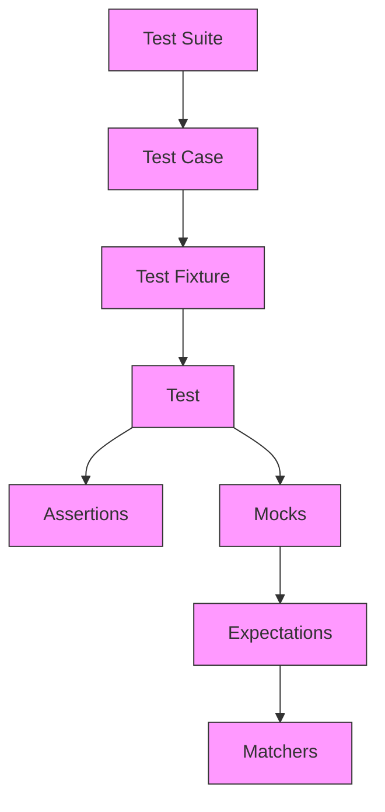

# Core Concepts and Terminology

## Introduction

Welcome to the essential foundation for understanding GoogleTest, the premier C++ testing framework. This document equips you with the core concepts and terminology you must know to write, read, and maintain effective tests with GoogleTest. Whether you're new to testing or refreshing your knowledge, these concepts form the backbone of your testing proficiency.

By mastering these terms, you'll unlock GoogleTest's full potential to deliver robust, maintainable, and precise unit tests.

---

## Key Concepts

### Test Case and Test

- **Test Case:** A collection or group of related tests typically targeting the same functionality or component.
- **Test (Test Method):** An individual unit of test logic verifying a particular behavior or condition.

*Example:* In GoogleTest, you organize tests using the `TEST` or `TEST_F` macros. Each invocation defines a test, and tests with the same suite name form a test case.

### Test Fixture

A test fixture provides a common environment for a set of tests. It allows you to write set-up and tear-down code once and reuse it among multiple tests.

*Example:* Using `TEST_F` and a fixture class enables sharing resource initialization and cleanup across tests verifying the same component.

### Assertion

Assertions are statements in your test that verify if expected conditions hold true. GoogleTest provides a rich set of assertion macros:

- `EXPECT_*` assertions report failures but let the test continue.
- `ASSERT_*` assertions report failures and immediately abort the current test.

*Example:* `EXPECT_EQ(value, expected);` verifies equality but continues the test even if it fails.

### Matchers

Matchers provide a flexible way to specify expected argument values in assertions and mock expectations. They evaluate conditions such as equality, relational comparisons, string pattern matching, and can even define complex predicates.

*Example:* GoogleTest and GoogleMock's matcher expressions like `_` (wildcard), `Ge(n)` (greater or equal), or custom matchers allow fine-grained control over argument expectations.

### Mocks and Mock Objects

Mocks are simulated objects that mimic the behavior of real objects in controlled ways for testing. They define expected interactions such as which methods will be called, with what arguments, and what those methods should return or do.

*Example:* GoogleMock lets you define mock classes with the `MOCK_METHOD` macro to replace real dependencies in tests.

### Expectations

An expectation describes an expected call to a mock method, including the argument constraints and call count.

*Example:* Using `EXPECT_CALL(mock_obj, Method(args))` you specify that the method should be invoked with given arguments, how many times, and what it should do when called.

### Test Failures: Fatal and Non-Fatal

- **Fatal Failures:** Triggered by `ASSERT_*`, causing immediate test abort.
- **Non-Fatal Failures:** Triggered by `EXPECT_*`, reported but allowing the test to continue.

Understanding when to use each ensures targeted and manageable test behavior.

### xUnit Architecture

GoogleTest follows the well-known xUnit testing architecture designed to:

- Automatically register tests.
- Run tests independently with set-up and tear-down.
- Manage test lifecycles and report results.

This standard approach benefits users by familiarity and ecosystem compatibility.

### Parameterized Tests

Parameterized tests allow running a test logic multiple times with varying inputs without duplication.

*Example:* GoogleTest provides `TEST_P` and `INSTANTIATE_TEST_SUITE_P` macros to create and instantiate parameterized tests.

---

## Why These Concepts Matter

Grasping these terms enables you to:

- Structure your tests logically and clearly.
- Write assertions that catch errors precisely.
- Use mocks effectively to isolate test subjects.
- Control test execution flow to maximize coverage and fault localization.
- Scale your test suite with reusable fixtures and parameterization.

This understanding empowers you to get the most accurate feedback from your tests and maintain high-quality C++ code.

---

## Practical Tips and Common Pitfalls

- Always define **virtual destructors** in interfaces you plan to mock.
- Use `EXPECT_CALL` only before the code under test exercises a mock.
- Choose `EXPECT_*` vs. `ASSERT_*` based on whether subsequent steps can be sensibly continued.
- Avoid over-specification in matchers; specify only what matters to the test.
- Be aware of **sticky expectations**—an expectation remains active after saturation unless `RetiresOnSaturation()` is used.
- Keep mocks **nice** (`NiceMock`) or **strict** (`StrictMock`) according to how much uninteresting call warnings you want.

---

## Summary Diagram: How Testing Elements Interact

---

## Getting Started with These Concepts

1. **Familiarize** yourself with the basic lifecycle: write test fixtures, define your tests, and place assertions.
2. **Learn** to use GoogleMock to create mock classes and set expectations.
3. **Apply** matchers and parameterized tests to increase the power and flexibility of your tests.
4. **Reference** the official guides such as the [gMock Cookbook](https://google.github.io/googletest/gmock_cook_book.html) and [gMock for Dummies](https://google.github.io/googletest/gmock_for_dummies.html) for detailed examples and advanced patterns.

This page provides the vocabulary essential for those deeper explorations.

---

## Additional Resources

- [What is GoogleTest?](overview/product-introduction-and-core-concepts/what-is-googletest)
- [gMock for Dummies](https://google.github.io/googletest/gmock_for_dummies.html)
- [gMock Cookbook](https://google.github.io/googletest/gmock_cook_book.html)
- [gMock Cheat Sheet](https://google.github.io/googletest/gmock_cheat_sheet.html)
- [Mocking Reference](api-reference/mocking-framework/mock-method-macros)

---

By understanding and applying these core concepts and terminologies, you will unlock the full potential of GoogleTest and GoogleMock to write expressive, maintainable, and reliable unit tests every time.