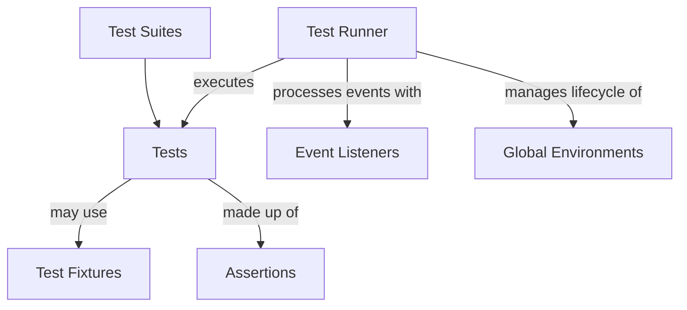

# What is GoogleTest?

## Introduction: Google's Leading C++ Test Framework

GoogleTest is Google's premier C++ testing framework designed to power robust, automated testing for projects of any scale—from open source libraries to enterprise-grade applications. It provides an easy-to-use yet powerful framework that integrates seamlessly into your C++ development workflow, enabling you to write, organize, and run tests with minimal friction.

## Why GoogleTest Matters

Imagine having to ensure every piece of your extensive C++ codebase behaves correctly, without getting bogged down by complex setup or unreliable tests. GoogleTest answers this pressing need by:

- Offering a rich set of assertions and macros that express test conditions clearly
- Automatically registering tests so you never have to manually maintain a test list
- Supporting cross-platform use on Linux, Windows, and Mac, ensuring your tests run consistently everywhere
- Facilitating advanced testing scenarios like parameterized and typed tests to cover multiple cases with ease

## What is GoogleTest?

At its core, GoogleTest is a C++ testing framework built to help developers write automated tests for their code. It embraces the xUnit architecture familiar from frameworks like JUnit but tailors it for C++'s unique challenges. Its primary purpose is to enable you to declare tests in simple macros, execute those tests with informative output, and integrate into any continuous integration or build system effortlessly.

### Core Purpose

GoogleTest empowers you to detect bugs early and document code behavior through test code that is as maintainable as production code. By isolating tests and providing detailed failure messages, it accelerates debugging and encourages best practices in software quality assurance.

### Key Differentiators

- Comprehensive assertion macros that distinguish between fatal and non-fatal failures
- Support for test fixtures (shared context across multiple tests) and global test environments
- Automated test discovery without explicit enumeration
- Powerful test filtering, repetition, and shuffling features to ease iterative development
- Extensible via advanced features like event listeners and mock integration

### High-Level Architecture

GoogleTest is composed of several components:

- **Test Suites** and **Tests**: Logical groupings of tests to mirror your code structure.
- **Test Fixtures**: Classes derived from `testing::Test` to share setup and teardown logic.
- **Assertions**: Macros that validate test conditions.
- **Test Runner**: Responsible for executing tests, handling setup/teardown, and reporting results.
- **Event Listeners**: Interfaces for hooking into the test execution lifecycle for custom reporting or tooling.

You write tests using macros like `TEST()` and `TEST_F()`, which register your tests automatically. The framework manages detailed results per test and suite, including handling success, failure, skips, and timed execution.

## Key Features & Capabilities

- **Simple Test Syntax**: Write tests within `TEST(TestSuiteName, TestName)` blocks, requiring no boilerplate.
- **Test Fixtures**: Use `TEST_F` with classes derived from `testing::Test` for common setup and teardown.
- **Parameterized Tests**: Implement data-driven tests with `TEST_P` and instantiate with input data via `INSTANTIATE_TEST_SUITE_P`.
- **Typed and Type-Parameterized Tests**: Run the same tests across multiple types with `TYPED_TEST` and `TYPED_TEST_SUITE` mechanisms.
- **Rich Assertions**: Assertions like `EXPECT_EQ`, `ASSERT_TRUE`, and many others make verifying code behavior expressive and readable.
- **Advanced Failure Messaging**: Use `testing::AssertionResult` and custom predicates for more informative failure outputs when simple boolean assertions fall short.
- **Global and Per-Suite Setup/Teardown**: Through `Environment` subclasses and static `SetUpTestSuite`/`TearDownTestSuite` methods.
- **Event Listener API**: Hook into the test lifecycle to modify or augment reporting and integrate with other tools.
- **Test Execution Control**: Shuffle, repeat, filter, and skip tests; control output verbosity and generate reports in XML or JSON.

### Real World Example

```cpp
// Simple test example
TEST(MathTest, Addition) {
  EXPECT_EQ(2 + 2, 4);
}

// Test fixture example
class FooTest : public testing::Test {
 protected:
  void SetUp() override {
    // Setup code here
  }
};

TEST_F(FooTest, DoesXyz) {
  EXPECT_TRUE(foo_.DoesXyz());
}

// Parameterized test example
class IsEvenTest : public testing::TestWithParam<int> {};

TEST_P(IsEvenTest, CheckEvenness) {
  int n = GetParam();
  EXPECT_EQ(n % 2, 0);
}

INSTANTIATE_TEST_SUITE_P(EvenNumbers, IsEvenTest, testing::Values(2, 4, 6, 8));
```

## Why Should You Care?

By choosing GoogleTest, you gain:

- **Faster Development Cycles**: Automated and repeatable tests reduce manual QA effort.
- **Greater Code Confidence**: Detailed failure messages and isolation improve reliability.
- **Better Test Organization**: Logical grouping and fixtures make large suites maintainable.
- **Cross-Platform Compatibility**: Run the same tests on Linux, Windows, and macOS seamlessly.
- **Flexibility and Extensibility**: Customize with event listeners or integrate with mocking frameworks.

## Getting Started Preview

To begin using GoogleTest:

1. Include the main header: `#include <gtest/gtest.h>`
2. Initialize the framework in your `main()` function by calling `testing::InitGoogleTest(&argc, argv);`
3. Define your tests using macros like `TEST()` or `TEST_F()`
4. Run all tests with `RUN_ALL_TESTS()`

Make sure your project is set up with the necessary build configuration to locate GoogleTest’s headers and libraries. For detailed platform-specific installation and building instructions, see the Getting Started documentation.

## Helpful Tips & Common Pitfalls

- Always use **`ASSERT_*`** macros to check conditions that must halt a test, and **`EXPECT_*`** when you want to continue even if a condition fails.
- Call `GTEST_SKIP()` in `SetUp()` or tests to skip tests at runtime cleanly.
- Avoid using underscores (`_`) in test suite and test names to prevent subtle issues.
- Use **Test Fixtures** and **Global Environments** strategically to manage resource expensive setup/teardown.
- Use `SCOPED_TRACE()` to add contextual information to failures occurring in helper routines or loops.
- Leverage parameterized and typed tests to reduce duplication and increase coverage.
- When testing private code, consider `FRIEND_TEST()` to allow access while preserving encapsulation.

## Troubleshooting

- If tests don’t run, ensure `RUN_ALL_TESTS()` is called in your `main`.
- For build or linking issues, verify compiler flags and that GoogleTest is linked correctly.
- When debugging flaky or slow tests, use flags like `--gtest_repeat`, `--gtest_shuffle`, and enable verbose output.

---

For further practical guidance, check the [GoogleTest Primer](../primer.md) and [Advanced Topics](../advanced.md) documents.

---

## Mermaid Diagram: GoogleTest Core Components Overview



---

_For complete examples and detailed usage, refer to the official GoogleTest GitHub repository and the comprehensive [Testing Reference](../reference/testing.md)._