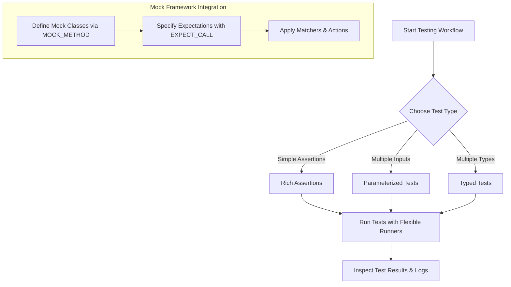

# Feature Overview

Explore the powerful features of GoogleTest that enable efficient, precise, and flexible unit testing in C++. This guided tour showcases the framework’s rich assertion commands, adaptable test runners, parameterized and typed tests, and seamless integration with GoogleMock for advanced mocking capabilities. Each feature section connects real-world testing challenges with practical solutions, enriched by examples that illustrate how to harness GoogleTest’s strengths in your development workflow.

---

## Rich Assertions: Elevate Your Test Precision

GoogleTest provides an extensive set of assert macros that empower you to express complex conditions clearly and effectively. Whether you need simple equality checks or want to verify detailed properties of your code, GoogleTest assertions simplify your task.

- **Value-Based Assertions**: Use `EXPECT_EQ`, `ASSERT_NE`, and their peers for straightforward equality and inequality checks.
- **Predicate-Based Assertions**: Apply `EXPECT_PRED*` and custom predicates to verify intricate conditions.
- **Scoped Assertions**: `EXPECT_THROW` and `ASSERT_NO_THROW` help you confirm exception-related behavior without clutter.

### Example

```cpp
EXPECT_EQ(result.size(), 3);
EXPECT_THROW(ProcessFile(filename), std::runtime_error);
```

Rich assertions translate complex verification logic into readable and maintainable test cases, enabling faster diagnosis and stronger guarantees about your code.

---

## Flexible Runners: Adapt Testing to Your Needs

GoogleTest supports multiple runners that handle the discovery, execution, and reporting of tests, accommodating a wide range of workflows:

- **Default Runner**: Automatically detects all tests and executes them according to your specifications.
- **Parameterized Runner**: Runs tests multiple times with different parameters, reducing code duplication and expanding test coverage.
- **Typed Tests Runner**: Enables writing generic test logic that automatically adapts to multiple data types.

This flexibility means you can align the testing process with your project's complexity and requirements.

---

## Parameterized and Typed Tests: Avoid Repetition, Embrace Coverage

Repetitive test logic is error-prone and hard to maintain. GoogleTest helps you write DRY (Don't Repeat Yourself) tests with capabilities tailored for variation:

- **Parameterized Tests**
  - Define a test once, run it multiple times with a suite of parameters.
  - Facilitates testing across diverse input cases systematically.

- **Typed Tests**
  - Write a single test template that works across different types.
  - Ideal for templated code bases or APIs working on various data structures.

### Example of Parameterized Test

```cpp
class MyTest : public ::testing::TestWithParam<int> {};
TEST_P(MyTest, HandlesVariousValues) {
  int param = GetParam();
  EXPECT_GT(param, 0);
}
INSTANTIATE_TEST_SUITE_P(ValidValues, MyTest, ::testing::Values(1, 2, 3));
```

This capability saves development time and ensures robust testing coverage.

---

## Deep GoogleMock Integration: Elevate Testing with Mocks and Matchers

GoogleTest’s advanced mocking framework, **GoogleMock**, is tightly integrated to empower you to simulate, observe, and verify complex interactions:

- **Mock Classes via `MOCK_METHOD`**
  - Easily create mock implementations of interfaces or abstract classes.
  - Supports const, noexcept, overloaded, and templated methods with a consistent syntax.

- **Flexible Expectations using `EXPECT_CALL`**
  - Specify expected function calls, argument conditions, order, and frequency.
  - Use sequences and partial orderings to model complex interaction flows.

- **Powerful Matchers**
  - Match arguments precisely using built-in matchers (_wildcard_, `Eq()`, `Ge()`, etc.) or custom predicates.
  - Combine and compose matchers for nuanced assertions.

- **Actions and Behaviors**
  - Define return values, side effects, and complex implementations via function objects or lambdas.
  - Support for default actions (`ON_CALL`) and layered expectations.

### Example: Defining a Mock Method

```cpp
class MockFoo {
 public:
  MOCK_METHOD(bool, Bar, (int n), (override));
};

MockFoo mock;
EXPECT_CALL(mock, Bar(::testing::Gt(0))).WillOnce(::testing::Return(true));
```

This integration turns your tests into interaction-based verifications, crucial for testing components with dependencies and side effects.

---

### Feature Summary Diagram



This flow highlights how GoogleTest features guide you from test writing to execution and analysis seamlessly.

---

## Practical Tips

- Use `EXPECT_CALL` sparingly; set expectations only where necessary to avoid brittle tests.
- Wrap complex return types or argument types with `using` alias or parentheses to prevent macro parsing errors in mocks.
- Prefer sequences when call order matters but keep tests flexible with partial ordering when possible.
- Suppress uninteresting call warnings by employing `NiceMock` when you don't want warnings for unused interactions.
- Remember: `MOCK_METHOD` macros must be declared in the `public` section of mock classes, regardless of the base method access level.

## Common Pitfalls

- Do not mock non-virtual functions directly without special handling.
- Avoid over-constraining expectations which cause tests to break with harmless refactors.
- Do not neglect to set default actions with `ON_CALL` when necessary to prevent unexpected mock behavior.
- Be mindful of the evaluation timing of actions; side effects in `WillOnce(Return(expr))` execute once at setup, not at runtime.

## Next Steps

Ready to put these features into action? Head over to the [Sample Workflows & Use Cases](/overview/quick-tour-features-usecases/sample-workflows) page to see how these capabilities come to life in real test scenarios. For detailed guidance on mock creation and interaction verification, consult the [Defining and Using Mock Classes](/guides/mocking-in-action/defining-mocks) and [Setting Expectations and Verifying Interactions](/guides/mocking-in-action/setting-expectations) pages.

---

## Additional Resources

- [gMock Cookbook](https://google.github.io/googletest/gmock_cook_book.html): In-depth recipes on mock usage, covering advanced topics.
- [gMock for Dummies](https://google.github.io/googletest/gmock_for_dummies.html): Beginner-friendly introduction to mocking with examples.
- [GoogleTest User's Guide - What Is GoogleTest?](/overview/introduction-core-value/what-is-googletest) for foundational concepts.
- [Mocking Reference](reference/mocking.md): Definitive API reference for macros, classes, and usage.

---

Harnessing GoogleTest’s core features accelerates your journey to robust, maintainable, and highly expressive testing in C++. This Feature Overview sets the stage to unlock testing productivity and confidence.
