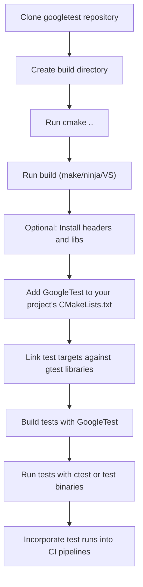

# Integration with Build Systems

GoogleTest integrates smoothly with a variety of popular build systems, providing flexible options whether you are using Bazel, CMake, or other build tools. This documentation outlines the primary integration approaches, helping you bring GoogleTest's robust C++ testing framework into your development and continuous integration workflows.

---

## Why Integration Matters

Integrating GoogleTest effectively with your build system ensures that your tests are compiled, linked, and executed consistently alongside your application code. This boosts developer productivity by enabling automated test runs, smooth debugging, and seamless pipelines for quality assurance.


## Integration Approaches Overview

### 1. Using CMake

CMake is the officially recommended build system for GoogleTest, favored for its cross-platform support and flexibility.

- **Standalone Build:** You can clone the GoogleTest repository and build it as a separate project. Typical commands are:

  ```bash
  git clone https://github.com/google/googletest.git -b v1.17.0
  cd googletest
  mkdir build
  cd build
  cmake .. -DBUILD_GMOCK=OFF
  make
  sudo make install
  ```

  This builds GoogleTest (optionally excluding GoogleMock) and installs its headers and libraries for use by other projects.

- **Embedding in Your Project:** A preferred and more flexible option is to include GoogleTest as part of your project's build. Use `add_subdirectory(googletest)` within your CMakeLists.txt. This approach enforces consistent compiler and linker settings across your project and tests, preventing subtle issues such as runtime library mismatches. 

- **FetchContent:** For dynamic integration, you can use CMake's `FetchContent` module to download and configure GoogleTest during your build's configuration step. Example snippet for your CMakeLists.txt:

  ```cmake
  include(FetchContent)
  FetchContent_Declare(
    googletest
    URL https://github.com/google/googletest/archive/5376968f6948923e2411081fd9372e71a59d8e77.zip
  )
  set(gtest_force_shared_crt ON CACHE BOOL "" FORCE)  # Fixes runtime linkage on Windows
  FetchContent_MakeAvailable(googletest)

  add_executable(example example.cpp)
  target_link_libraries(example gtest_main)
  add_test(NAME example_test COMMAND example)
  ```

- **Compiler and Linker Flags:** GoogleTest requires a C++17-capable compiler, and the CMake build scripts handle fine-tuned compiler/linker flags adjustments tailored for MSVC, Clang, GCC, and other compiler toolchains. You can customize these if needed via cache variables such as `gtest_force_shared_crt`.


### 2. Using Bazel

While this documentation focuses on CMake, GoogleTest and GoogleMock are also commonly integrated into Bazel-based build systems. Bazel users typically add GoogleTest and GoogleMock as external dependencies or workspace rules, allowing them to write and run tests natively within Bazel’s build and test lifecycle. For specific instructions, consult the [Bazel documentation](https://docs.bazel.build/versions/master/be/testing.html) and GoogleTest’s own Bazel setup in its GitHub repository.


### 3. Other Build Systems

GoogleTest’s source files and headers can be manually added or imported into other build systems such as Makefiles, Ninja, Visual Studio projects, or IDE-integrated native build scripts. The focus is on:

- Including GoogleTest headers in your test code 
- Compiling GoogleTest source files alongside your tests
- Linking your test binaries against the GoogleTest libraries

This manual approach requires managing compiler and linker flags yourself and is more error-prone but feasible for lightweight or legacy projects.


## Continuous Integration and Automated Testing

GoogleTest’s integration with build systems strongly complements CI/CD pipelines. By automating the build and test execution steps, you can achieve:

- **Early Bug Detection:** Fail the build immediately when tests fail.
- **Consistent Environments:** Use the same build configuration for tests and production code.
- **Reporting:** Generate test reports consumable by CI dashboards.

GoogleTest supports running tests in batch mode (`RUN_ALL_TESTS()`), which can be invoked from CI scripts or tools. CTest integration with CMake further facilitates running tests as part of scripted pipelines.


## Practical Example: Building and Running Tests with CMake

1. Clone the GoogleTest repository:

   ```bash
   git clone https://github.com/google/googletest.git -b v1.17.0
   cd googletest
   mkdir build && cd build
   cmake ..
   make
   sudo make install
   ```

2. In your project, add the following to your CMakeLists.txt:

   ```cmake
   find_package(GTest CONFIG REQUIRED)
   add_executable(my_test my_test.cpp)
   target_link_libraries(my_test GTest::gtest_main)
   add_test(NAME my_test COMMAND my_test)
   ```

3. Build your project:

   ```bash
   mkdir build && cd build
   cmake ..
   make
   ctest
   ```

You will see GoogleTest execute all tests and report results.


## Best Practices and Tips

- Prefer embedding GoogleTest into your project using CMake’s `add_subdirectory()` or `FetchContent` rather than installing it globally. This avoids version mismatch problems.

- On Windows, consider setting `gtest_force_shared_crt` to ON to align runtime linkage.

- Always ensure your compiler supports C++17 or later since GoogleTest requires it.

- When customizing compiler/linker flags, use the internal functions provided by GoogleTest’s `cmake/internal_utils.cmake` to maintain compatibility.

- Use `add_test()` in CMake to integrate tests with CTest and CI tools smoothly.


## Troubleshooting Common Integration Issues

<AccordionGroup title="Common Issues and Solutions">
<Accordion title="Runtime Library Mismatches on Windows">
  When you see linker errors regarding different runtime libraries (e.g., MTd vs MDd), set the CMake option `-Dgtest_force_shared_crt=ON` to force GoogleTest and your project to use the same runtime linkage.
</Accordion>
<Accordion title="Missing pthread Support">
  If tests fail to link on platforms requiring pthread, ensure the pthreads library is available and linked properly. GoogleTest’s CMake scripts detect and link pthread automatically when available.
</Accordion>
<Accordion title="Incompatibility with Older Compilers">
  GoogleTest requires C++17. Using older compilers results in compile errors. Upgrade to a supported compiler version.
</Accordion>
</AccordionGroup>


---

## Additional Resources

- [Getting Started Guide](/overview/quickstart-integration/getting-started) — For step-by-step setup and integration.
- [CMake Build Documentation](https://github.com/google/googletest/blob/main/README.md) — Official instructions and options.
- [GoogleMock Integration](/guides/getting-started/first-mock-example) — How to add mocking with GoogleMock.
- [CI/CD and Project Integration](/guides/advanced-and-integrations/test-integration-workflows) — For building tests into automated pipelines.


---

### Illustrative High-Level Workflow for CMake Integration



This sequence highlights the typical steps users take to incorporate GoogleTest effectively.

---

By choosing the approach best suited to your environment, you integrate GoogleTest seamlessly, enabling reliable, maintainable C++ testing workflows tailored to your project’s needs.
