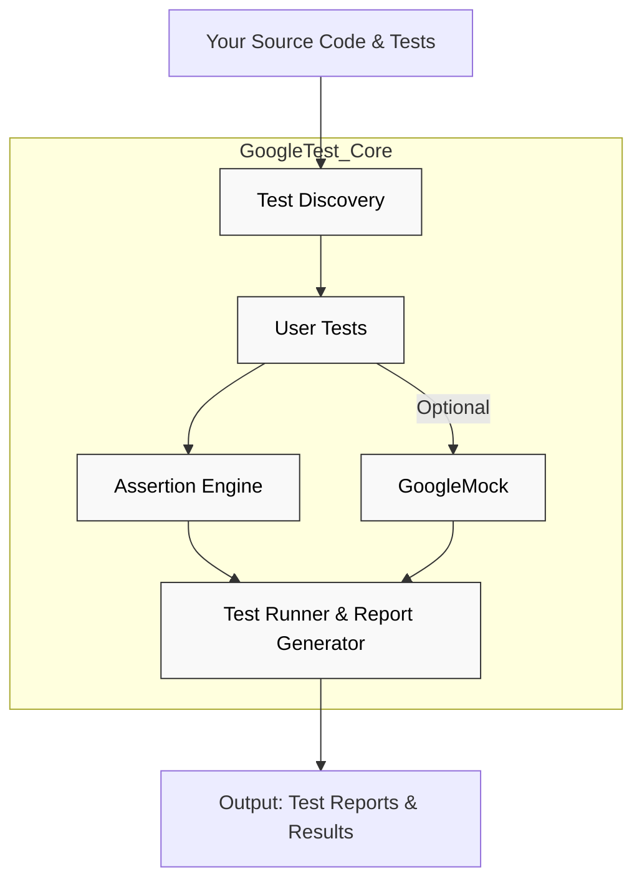

# System Architecture Diagram

## Overview

This diagram provides a clear and concise architectural visualization of GoogleTest's major components and their interactions. It illustrates how the core modules—such as Test Discovery, Assertion Engine, User Tests, and the optional GoogleMock component—work together to power seamless C++ testing and mocking.

Understanding this architecture will help you grasp the flow of control from your codebase through test execution and onto generating insightful test reports.

---

## Components and Workflow

- **Test Discovery Module**: Automatically identifies and collects all test cases and suites in your code, enabling efficient and automated test execution.

- **User Tests**: Your actual test code written against GoogleTest APIs, invoking assertions and test logic.

- **Assertion Engine**: The core engine evaluating assertions embedded in tests, validating expected vs actual results.

- **GoogleMock (Optional)**: Provides powerful mocking capabilities for creating mock classes, setting expectations, and verifying interactions.

- **Test Runner & Report Generator**: Orchestrates running discovered tests, executes user test code, collects assertions and mock verifications, and produces detailed reports.

---

---

## How It Works

1. **Test Discovery** scans your compiled test binaries to register available tests.
2. The **Test Runner** selects and runs these tests as per user commands or defaults.
3. **User Tests** run, invoking test logic that uses assertions to validate behavior.
4. The **Assertion Engine** evaluates and records assertion outcomes.
5. If your tests incorporate mocks, **GoogleMock** tracks and verifies mock method calls and expectations.
6. The **Test Runner & Report Generator** aggregates results and outputs detailed reports.

---

## Why This Matters

By understanding this architecture, you can better design your tests and mocks, optimize test runs, and troubleshoot issues related to test discovery failures or assertion mismatches. It shows the separation of concerns enabling modular extensibility, such as integrating GoogleMock optionally without disrupting core testing functionalities.

---

## Further Exploration

Dive deeper into each component using these guides:

- [Test Macros and Structure](../../api-reference/core-unit-testing/test-macros.md) — How to write and organize tests.
- [Assertions Reference](../../api-reference/core-unit-testing/assertions.md) — Detailed assertion capabilities.
- [Mock Class and Method Macros](../../api-reference/mocking-matching-actions/mock-class-macros.md) — Defining and using mocks.
- [Defining Expectations and Verifying Behavior](../../guides/mocking-techniques/defining-expectations-and-verifying-behavior.md) — Best practices for mocks.

---

## Practical Tips

- Use GoogleMock when your tests require monitoring and controlling interactions with dependencies.
- Keep test discovery fast by limiting test binaries and using filtering features.
- Understand that assertion failures immediately surface issues during test runs.
- Customize the test runner to suit your CI/CD pipelines effectively.

---

## Troubleshooting

- If no tests are discovered, verify your test registration macros and build settings.
- Unexpected test failures could indicate missing mocks or missing expectations.
- Use verbose test runner output to trace assertion evaluations and mock verification.

---

For complete workflows, explore the [System Architecture & Integration Section](../../overview/system-architecture-and-integration/system-architecture-and-integration.md).

---

> "This architectural diagram is your gateway to mastering GoogleTest's testing engine and leveraging its mocking framework effectively."

