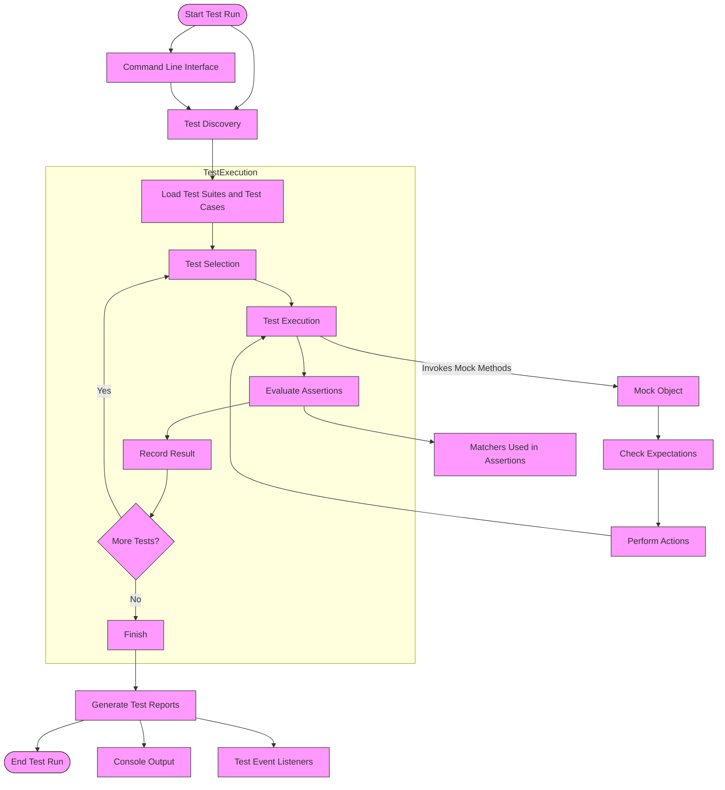

# Architecture Overview

## Understanding GoogleTest and Google Mock Architecture

GoogleTest (including its Google Mock component) is a comprehensive C++ testing framework designed to streamline the creation and execution of tests with powerful mocking capabilities. This page provides a system-level visualization of the major components and data flows, showing how test discovery, execution, assertion evaluation, and result reporting work in harmony.

---

## Why This Architecture Matters to You

Whether you are writing your very first test or designing complex test suites for large projects, understanding this architecture helps you:

- Comprehend how tests are automatically discovered and executed.
- Leverage Google Mock to precisely control and verify interactions.
- Interpret how results are reported and failures diagnosed.
- Optimize test design by fitting your tests into GoogleTest's workflows.

---

## Core Architectural Components

### Test Discovery & Execution Engine
- **Test Runner:** Orchestrates test lifecycle — from discovery to execution.
- **Test Suites and Test Cases:** Logical grouping and execution units.

### Assertion and Matcher System
- **Assertions:** Your tests’ primary checks that validate behavior and state.
- **Matchers:** Powerful predicates to specify argument constraints for mocks.

### Mock Object Framework (Google Mock)
- **Mock Classes:** Substitute real components by mocking their interfaces.
- **Expectations and Actions:** Define expected calls; specify return values and side effects.

### Result Reporting and Logging
- **Test Result Collector:** Aggregates pass/fail data.
- **Detailed Failure Logs:** Captures assertion failures for diagnostics.

### User Interface & Integration
- **Command Line Interface:** Configuration flags govern verbosity, filtering, and more.
- **Test Event Listeners:** Hooks for customizing reports and integrations.

---

## System-Level Workflow

Below is a Mermaid flowchart depicting the interactions between these components during a typical test run.

---

## Detailed Component Descriptions

### Test Discovery
GoogleTest uses macros and registration functions at compile time and runtime to enumerate all tests defined in the program. This mechanism requires minimal user intervention—simply write tests, and they are discovered automatically.

### Test Execution
The test runner sequentially executes each discovered test. Execution is isolated such that failures in one test do not impact others. During execution, assertions verify correctness.

### Assertions and Matchers
Assertions evaluate if expected conditions are true. When combined with matchers, they allow expressive validation of complex conditions, such as verifying that a mock method was called with specific argument patterns.

### Google Mock and Mock Objects
Mocks are specially generated classes that allow you to simulate and verify the behavior of real components in your tests. Using macros like `MOCK_METHOD`, you define mock classes that intercept method calls and validate interactions.

- **Expectations** specify which methods should be called, how many times, and with what parameters.
- **Actions** define what mocked methods should return or do when called.

### Result Reporting
Upon completion, GoogleTest aggregates all test results and provides detailed diagnostic messages for any failures encountered, including stack traces, argument values, and the source location of failed assertions.

### Extensibility
GoogleTest supports command-line flag adjustments, custom test event listeners, and supports integration with both IDEs and continuous integration platforms.

---

## Practical Example: How a Mock Call is Processed

1. Your test executes and calls a method on a mock object.
2. The mock intercepts the call and checks if an expectation matches.
3. If matched, the specified action executes (e.g., returns a value, invokes a callback).
4. If unmet or unexpected, GoogleTest reports a detailed error.

---

## Best Practices

- **Write clear, isolated test cases:** Leverage automatic test discovery.
- **Define expectations early:** Use `EXPECT_CALL` before exercising mocks.
- **Use matchers to specify argument constraints:** Helps focus tests on what matters.
- **Employ action chaining:** Use `WillOnce()` and `WillRepeatedly()` for precise behavior.
- **Handle asynchronous code carefully:** Use mechanisms like notifications to synchronize.
- **Control verbosity:** Use `--gmock_verbose` to tune logging detail.

---

## Summary
Understanding this architecture empowers you to write better tests, leverage Google Mock's features effectively, and diagnose problems efficiently.

---

## Next Steps
- Start with the [GoogleTest Primer](primer.md) to write your first tests.
- Dive into [Mocking for Dummies](gmock_for_dummies.md) to learn mocking basics.
- Explore [gMock Cookbook](gmock_cook_book.md) for advanced mocking recipes.

---

## External Resources
- [GoogleTest GitHub Repository](https://github.com/google/googletest)
- [gMock for Dummies Guide](https://google.github.io/googletest/gmock_for_dummies.html)
- [GoogleTesting Blog](https://testing.googleblog.com)

---

## See Also
- [Core Concepts and Terminology](/overview/system-architecture-and-key-concepts/core-concepts-and-terminology)
- [Defining and Using Mocks](/api-reference/mocking-apis/defining-mocks)
- [Actions Reference](/api-reference/mocking-apis/actions)

---