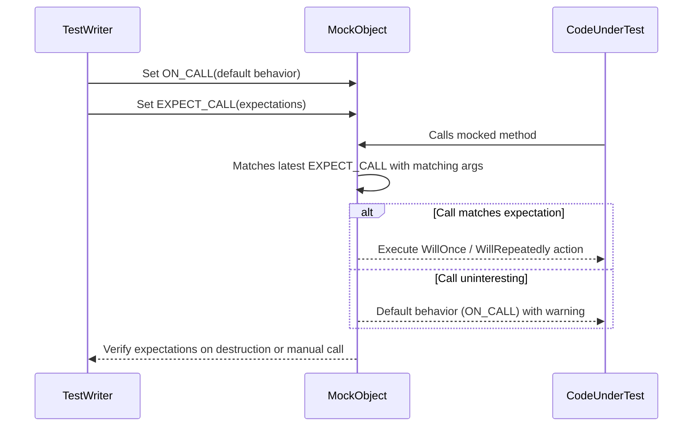

# Core Concepts and Terminology

Welcome to the foundation of writing, organizing, and reasoning about tests with GoogleTest and Google Mock. This page explains the essential terms and concepts you will encounter daily: test cases, test suites, assertions, matchers, death tests, parameterized tests, mocks, and more. Mastering these concepts is crucial for effective and maintainable test design.

---

## Understanding Tests in GoogleTest

### Test Case and Test Suite

- A **test case** (sometimes called a **test suite**) is a collection of related tests that share common setup and teardown logic.
- Each test case groups individual **tests** which verify a specific behavior or component.

Example:
```cpp
// Defines a test suite named MathTest
TEST(MathTest, AdditionWorks) {
  EXPECT_EQ(2 + 2, 4);
}

TEST(MathTest, SubtractionWorks) {
  EXPECT_EQ(5 - 3, 2);
}
```

Here, `MathTest` is the test case/suite containing two tests.

---

### Assertions

Assertions are the core mechanisms you use to check for expected conditions in tests. When an assertion fails, the test logs an error and either aborts or continues, depending on the assertion type.

GoogleTest provides a rich assertion library with two primary types:

- **Fatal assertions** (`ASSERT_*` macros): Abort the current test immediately on failure.
- **Non-fatal assertions** (`EXPECT_*` macros): Log failure but let the test continue.

Common examples:
```cpp
EXPECT_EQ(val, expected);      // Checks equality, continues if failed
ASSERT_TRUE(condition);        // Checks that condition is true, aborts if false
```

Use assertions to verify behaviors, invariants, and validate results precisely.

---

### Matchers

Matchers are predicates that specify **what arguments you expect a function or mock method to be called with**. They extend assertions into parameter matching for functions.

- **Why matchers?** Mock expectations often need flexibility: for example, match any value, check ranges, or validate complex objects.
- `_` (underscore) is the wildcard matcher to accept any argument value.

Example:
```cpp
using ::testing::_;
EXPECT_CALL(mock_obj, Foo(_));       // Expects Foo() to be called with any argument
EXPECT_CALL(mock_obj, Bar(Ge(5)));   // Expects Bar() called with argument >= 5
```

Matchers support composition and can be combined for expressive parameter constraints.

---

## Advanced Test Constructs

### Parameterized Tests

GoogleTest supports running the same test logic over multiple data inputs, reducing code duplication and increasing coverage. Use parameterized tests to specify:

- A test fixture template
- A data source with values or types

Example:
```cpp
class MyTest : public testing::TestWithParam<int> {};

TEST_P(MyTest, IsEven) {
  int value = GetParam();
  EXPECT_EQ(value % 2, 0);
}

INSTANTIATE_TEST_SUITE_P(EvenValues, MyTest, testing::Values(2, 4, 6));
```

This runs `IsEven` test for each value: 2, 4, and 6.

---

### Death Tests

Death tests verify that certain code paths result in program termination (e.g., calls to `abort()`, `exit()`, or fatal failures).

Use them to ensure your code fails safely and predictably on invalid inputs or states.

Example:
```cpp
EXPECT_DEATH(
  {
    MyFunc(-1);  // Should terminate
  },
  "Invalid argument"
);
```

The test passes if `MyFunc(-1)` crashes with an error message matching `Invalid argument`.

---

## Google Mock Concepts: Mocking and Expectations

### Mock Objects

A **mock object** mocks an interface (or class) to simulate the behavior of a collaborator in your system. It records how it is called and verifies that usage matches the expectations.

To create a mock:

- Define a mock class abiding by the interface's virtual methods
- Use `MOCK_METHOD` macros to define mock methods

Example:
```cpp
class MockTurtle : public Turtle {
 public:
  MOCK_METHOD(void, PenUp, (), (override));
  MOCK_METHOD(void, PenDown, (), (override));
  MOCK_METHOD(void, Forward, (int distance), (override));
  MOCK_METHOD(void, Turn, (int degrees), (override));
  MOCK_METHOD(void, GoTo, (int x, int y), (override));
  MOCK_METHOD(int, GetX, (), (const, override));
  MOCK_METHOD(int, GetY, (), (const, override));
};
```

---

### Setting Expectations

Determine **how** and **when** you expect the mock's methods to be called using macros:

- `EXPECT_CALL(mock, Method(args))` — sets an expectation that the method will be called
- Optionally specify:
  - **Matcher(s)** for arguments
  - **Cardinality**: how many times the call is expected (`Times()`, `AtLeast()`, `AnyNumber()`, etc.)
  - **Ordering constraints** (`InSequence()`, `After()`) for call order
  - **Actions** (`WillOnce()`, `WillRepeatedly()`) for behavior and return value

Example:
```cpp
EXPECT_CALL(turtle, PenDown())
    .Times(AtLeast(1));
EXPECT_CALL(turtle, Forward(Ge(5)))
    .WillRepeatedly(Return());
```

---

### Behavior Specification

You can specify mock method behavior:

- `ON_CALL(mock, Method(args)).WillByDefault(action)` — default behavior for calls that don't have expectations
- `EXPECT_CALL(...).WillOnce(action)` — specify what happens for specific call
- `WillRepeatedly(action)` — behavior after all `WillOnce` actions are exhausted

Actions can be simple returns, lambda functions, or complex sequences.

---

### Call Ordering

- By default, call order isn't enforced unless specified explicitly.
- Use `InSequence` blocks to enforce strict ordering:

```cpp
{
  InSequence s;
  EXPECT_CALL(mock, FirstCall());
  EXPECT_CALL(mock, SecondCall());
}
```

- Use the `After` and `InSequence` clauses to define partial orders on expectations.

---

### Uninteresting Calls and Strictness

- An **uninteresting call**: A mock method called for which no `EXPECT_CALL` was set.
- By default, uninteresting calls print a warning but do not cause test failure.
- Use `NiceMock<T>` to suppress warnings for uninteresting calls.
- Use `StrictMock<T>` to treat uninteresting calls as errors.

Example:
```cpp
NiceMock<MockTurtle> nice_turtle;
StrictMock<MockTurtle> strict_turtle;
```

---

### Common Pitfalls & Best Practices

- **Always set expectations before exercising the code that calls the mocks.**
- **Beware of mock method expectations order due to 'newer overrides older' rule.**
- Use wildcard matcher `_` when argument values are not important.
- Use `RetiresOnSaturation()` to retire expectations automatically after their cardinality is met.
- Avoid over-specifying argument matchers to prevent brittle tests.

---

## Summary Diagram: Mock Expectation Flow



---

## Getting Started with Core Concepts

To begin, explore writing simple tests, then expand your knowledge to:

- Use assertions in your tests
- Understand and use matchers for argument constraints
- Define parameterized tests for parametrized input coverage
- Leverage death tests for failure scenarios
- Design and use mocks effectively to control dependencies

Refer to **[Writing Your First Test](../guides/getting-started/writing-your-first-test)**, **[Using Assertions Effectively](../guides/getting-started/using-assertions)**, and **[Mocking with GoogleMock](../guides/advanced-testing-patterns/using-googlemock)** for step-by-step guides.

---

## Tips for Success

- Start writing tests with simple assertions and build confidence progressively.
- Use mocks to isolate code and observe interactions rather than relying solely on state verification.
- Use `ON_CALL` for specifying harmless default behaviors and `EXPECT_CALL` when you want to verify interactions.
- Use `NiceMock` in early phases to avoid noisy warnings, move to `StrictMock` to enforce cleaner tests.
- Read warnings carefully to diagnose uninteresting/unexpected calls and adjust expectations accordingly.

---

## Troubleshooting Common Issues

### Unmatched Calls or Failures

- Verify `EXPECT_CALL`s precede code exercising mocks.
- Check argument matchers for accuracy and precision.
- Use `--gmock_verbose=info` flag to log calls and expectation matches.

### Over-Specified Expectations

- Avoid specifying all arguments if unnecessary, use `_` matcher for "don't care" positions.
- Use sequences or actions to clarify expected order and behavior.

### Default Actions Not Working

- Check if `ON_CALL` was set correctly.
- Use `WillByDefault` to set default return values or actions.

### Mock Class Compilation Issues

- Ensure `MOCK_METHOD` calls are inside `public:` section.
- Wrap complicated types involving commas in parentheses or use type aliases.
- For const or noexcept methods, add appropriate qualifiers in `MOCK_METHOD`.

---

## Additional Resources

- [GoogleTest Introduction](../overview/getting-to-know-googletest/introduction-to-googletest)
- [Core Features and Value](../overview/getting-to-know-googletest/core-features-and-value)
- [Writing Your First Test](../guides/getting-started/writing-your-first-test)
- [Mocking with GoogleMock](../guides/advanced-testing-patterns/using-googlemock)
- [Matchers Reference](../api-reference/core-apis/matchers)
- [Assertions Reference](../api-reference/core-apis/assertions)
- [Mocking Reference](../reference/mocking)

---

## Summary
This page provides a comprehensive understanding of the key terms and concepts that define how you write and think about tests in GoogleTest and Google Mock. It empowers you to write clear, expressive, and maintainable tests through structured test cases, rich assertions, flexible parameterization, and powerful mocking capabilities.

---