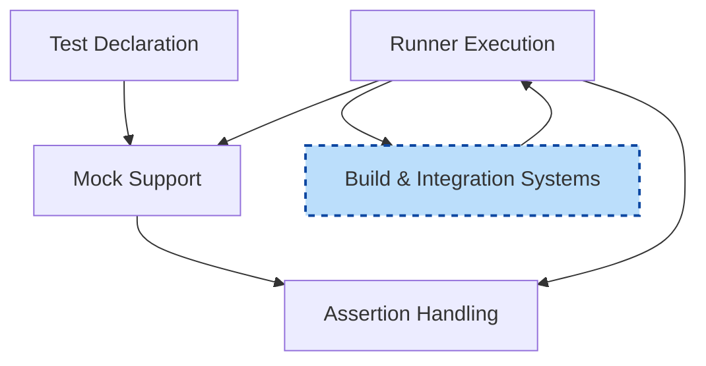

# Architecture Overview

## Unlocking the Structure Behind GoogleMock

Welcome to the Architecture Overview, where we reveal the foundational blueprint that powers GoogleMock — Google's versatile C++ mocking framework. This page presents a clear, simplified system diagram illustrating how the core components interact seamlessly to deliver a robust, extensible mocking experience.

Whether you're a developer new to GoogleMock or revisiting the architecture to better understand integration and extensibility, this overview lays the groundwork for mastering the framework's inner workings.

---

## Core Components of GoogleMock Architecture

At its heart, GoogleMock orchestrates four major components working together to support mocking, expectation verification, and test execution:

- **Test Declaration:** Where mock classes and methods are defined, providing the user interface for mocks.
- **Mock Support:** Components that manage mock object state, method call matching, and expectations.
- **Assertion Handling:** Mechanisms that check whether expectations are met, providing feedback on test success or failure.
- **Runner Execution:** Responsible for executing tests and managing the lifecycle of mocks and expectations.

This high-level architecture balances flexibility and integration capability, enabling GoogleMock to fit naturally in diverse build and test environments.

---

## Simplified System Diagram

Below is a Mermaid.js flowchart illustrating how these components interact during the testing process:

---

## How This Architecture Benefits You

By modularizing responsibilities into clear components, GoogleMock provides:

- **Easy Mock Definition and Usage:** The Test Declaration component offers a straightforward, macro-based syntax (`MOCK_METHOD`) that maps directly to C++ interfaces.
- **Robust Expectation Management:** Mock Support dynamically manages expectation matching and behavior dispatch, shielding test authors from complexity.
- **Clear Feedback via Assertions:** Assertions verify mock interactions, immediately reporting unmet expectations.
- **Seamless Integration with Your Build:** The Runner Execution coordinates smoothly with existing build systems, allowing you to adopt GoogleMock without disruption.

For example, when writing a test that mocks a network interface, the mock class declaration goes into Test Declaration; when your test runs, Runner Execution triggers mock methods, which Mock Support intercepts; assertions verify calls and report any failures, all orchestrated within your existing build pipeline.

---

## Extensibility and Integration

GoogleMock’s architecture is designed for easy extension:

- You can extend matchers and actions within Mock Support to customize behavior.
- Test Runners are compatible with custom and third-party test executors.
- Build Systems need only invoke the Runner, ensuring GoogleMock fits into virtually any C++ environment.

This ensures long-term maintainability and adaptability for projects of all sizes.

---

## Practical Tips for Navigating the Architecture

- Define your mock classes using `MOCK_METHOD` macros within the Test Declaration component.
- Use `EXPECT_CALL` to set call expectations; understand that newer `EXPECT_CALL`s override older ones, enabling flexible behavior specification.
- Verify interactions and expectations are confirmed automatically upon mock destruction; you can also force verification early via `Mock::VerifyAndClearExpectations`.
- Control the order and cardinality of calls with sequences and cardinality clauses to enforce strict or partial ordering.

Refer to the [Mocking Reference](../reference/mocking.md) and [gMock Cheat Sheet](../gmock_cheat_sheet.md) for quick access to syntax and commonly used features.

---

## Further Exploration

Explore these linked pages to deepen your grasp:

- [About GoogleTest](../../overview/product-intro-core-concepts/about-googletest) — foundational concepts of GoogleTest.
- [Key Concepts & Terminology](../../overview/product-intro-core-concepts/key-concepts-terminology) — understand assertions, fixtures, mocks, and matchers.
- [Target Audience & Use Cases](../../overview/product-intro-core-concepts/target-audience-and-use-cases) — real-world scenarios for effective usage.

You’re also encouraged to dive into the [Mocking Reference](../reference/mocking.md) for detailed API usage and [gMock Cookbook](../../docs/gmock_cook_book.md) for practical examples.

---

## Summary

This Architecture Overview provides the foundational understanding of how GoogleMock components collaborate:

- Test Declaration defines mocks
- Mock Support manages behavior and expectations
- Assertion Handling verifies correctness
- Runner Execution orchestrates test runs

This structure empowers you to write expressive, maintainable C++ tests that integrate smoothly into your existing development ecosystem.

---