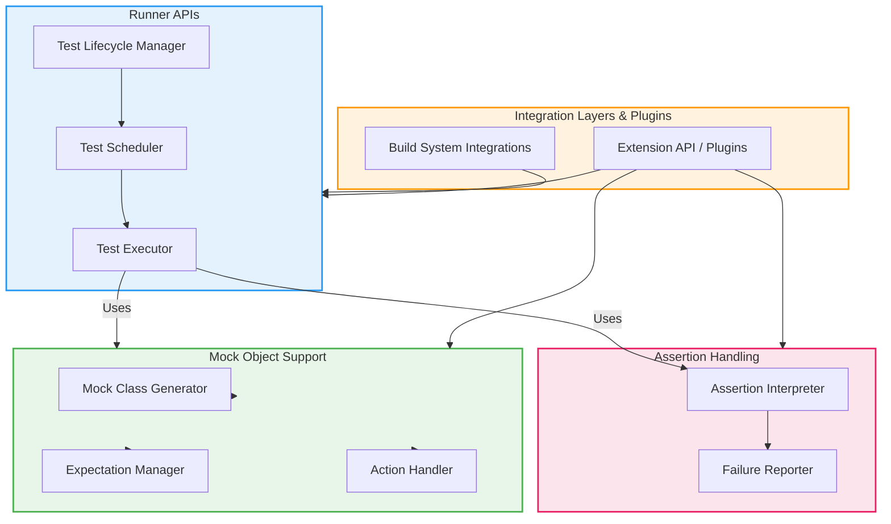

# System Architecture Overview

Discover the high-level architecture of GoogleTest and GoogleMock to understand how core components collaborate seamlessly to power your testing workflows. This overview graphically reveals the primary building blocks — including runner APIs that execute and manage tests, assertion handling mechanisms ensuring precise validation, mock object frameworks for interaction verification, and integration layers facilitating extensibility. By exploring the architecture diagram, you gain clear context on how these components interoperate and how extensions or plugins can be incorporated to tailor the system to your needs.

---

## Why This Overview Matters

Navigating complex systems can be daunting. This page presents a bird's-eye view that helps you quickly grasp the essential components and their relations. Instead of diving into code or detailed usage, you get a conceptual map that guides you in understanding where each piece fits, what to expect from each part, and how they collectively deliver robust testing capabilities.

---

## Core Components at a Glance

- **Runner APIs**: The engine that launches and controls the execution of tests. They handle test lifecycle management, sequencing, and result collection, ensuring your tests run reliably and predictably.

- **Assertion Handling**: The foundation for validating test outcomes. It interprets various assertion constructs, verifies conditions during test execution, and communicates failures precisely.

- **Mock Object Support**: An advanced layer enabling simulation of dependencies using mock objects. It provides APIs to define, set expectations on, and verify interactions with these mocks, empowering interaction-based testing.

- **Integration Layers**: These provide connectivity between core testing components and external frameworks, build systems, or custom extensions. They serve as hooks and extension points to incorporate plugins and adapt GoogleTest/GoogleMock into varied environments.

---

## Understanding the Architecture Diagram

*Diagram Key:* Each box represents a core subsystem, arrows indicate usage or dependency.

---

## How to Use This Page

- **Get Context Quickly**: Refer here whenever you need to orient yourself about the system's structure before diving into deeper guides or references.

- **Identify Extension Points**: If you plan to build plugins or custom integrations, focus on the "Integration Layers" and how they connect to core components.

- **Understand Test Flows**: Follow the arrows in the diagram to understand how tests progress from scheduling through execution to assertion verification.

---

## Practical Tips

- Treat the system as modular: The clear separation between runner APIs, assertion handling, mocks, and integration layers means you can learn or extend each independently.

- Use this diagram alongside deeper documentation, such as the [Integration & Typical Workflows](../integration-and-workflows) page for real-world scenarios.

- When troubleshooting, understanding which layer you’re dealing with can save time; for example, assertion failures come from the Assertion Handling subsystem.

---

## Next Steps

Ready to explore how this architecture enables daily testing tasks? Visit the **Integration & Typical Workflows** page next to see how these components collaborate in your actual testing processes. If you want to dive into the core concepts first, check out the [GoogleTest Primer](../../intro-product-basics/primer) and [Mock Object Model](../../../concepts/mocking-behavior/mock-object-model) pages.

---

## Related Documentation

- [Integration & Typical Workflows](../integration-and-workflows.html) – Explores how architecture translates into real usage.
- [GoogleTest Primer](../../intro-product-basics/primer.html) – Beginner-friendly introduction to testing basics.
- [Mocking for Dummies](../../gmock_for_dummies.html) – Learn how mocks fit into testing.
- [API References](../../../api-reference/) – In-depth function and interface documentation.

---

Gain clarity. Understand the system. Master your testing journey.

---

<Info>
This overview provides a conceptual map without delving into implementation details. For step-by-step practical guidance, see the Integration & Typical Workflows page.
</Info>
