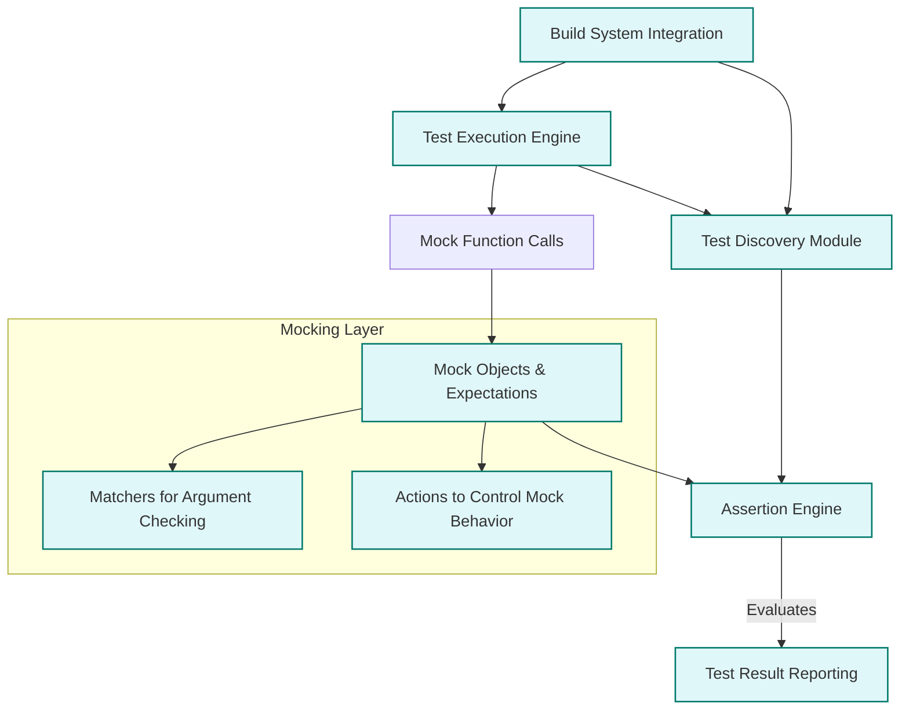

# Architecture Overview (with Diagram)

## Visualizing the Core Components

Understanding the architecture of GoogleTest and GoogleMock is essential to harness their full testing and mocking capabilities effectively. This page presents a comprehensive Mermaid diagram illustrating the primary components and how they interact. By exploring these key modules — including test discovery, assertion engines, mocking layers, matchers, actions, and build system integration — you will gain a clear picture of the internal workflows that power robust, maintainable testing in C++ environments.

---

## Key Components and their Roles

### 1. Test Discovery
GoogleTest automatically finds all tests in your codebase without requiring manual registration. This dynamic discovery enables effortless scalability and integration into continuous testing workflows. The discovery module scans compiled test executables to list available test fixtures and test cases, making test execution streamlined.

### 2. Assertion Engine
Assertions form the backbone of GoogleTest's verification process. The assertion engine evaluates test expectations, reporting successes or failures with detailed diagnostics. It supports a rich set of assertion macros and failure handling, ensuring your tests precisely verify expected behavior.

### 3. Mocking Layer
At the heart of GoogleMock lies the mocking layer, which lets you create mock objects to emulate interfaces and control their behavior for isolated testing.

- **Mock Objects:** Users define mocks with intuitive macros that generate implementations automatically.
- **Expectation Handling:** Expectations set on mock methods drive validation of interactions.
- **Automatic Verification:** When mock objects go out of scope, verification occurs without user intervention.

### 4. Matchers
Matchers provide a powerful DSL to specify argument constraints and behaviors in mock expectations.

- They validate whether method arguments meet expected criteria.
- Support both built-in and custom matcher definitions.

### 5. Actions
Actions determine the behavior that mocks exhibit when invoked. These include returning values, invoking callbacks, or performing side effects.

- Users can combine actions for complex behaviors.
- They enable simulation of diverse scenarios including error conditions.

### 6. Build System Integration
Seamless integration with popular build systems (e.g., CMake, Bazel) ensures that GoogleTest and GoogleMock work efficiently in your development pipeline.

- Facilitates dependency tracking and automatic test execution.
- Supports standard and custom build workflows.

---

## How Major Files and Modules Interact

The following Mermaid flowchart captures the flow and interaction between these components inside the GoogleTest/GoogleMock framework:

This diagram illustrates the seamless coordination between your tests and GoogleTest’s core machinery — starting with test discovery, flowing through execution and validation with assertion and mocking subsystems, culminating in clear reporting and smooth build integration.

---

## Practical Insights into the Architecture

- The test discovery system frees you from manual test registration, enabling continuous expansion of your tests without overhead.
- The assertion engine’s comprehensive failure reporting guides quick diagnosis and resolution.
- GoogleMock’s mocking layer emphasizes clarity and maintainability, offering an expressive syntax to write expectations, specify argument validation with matchers, and control behavior with actions.
- Build system integration aligns with modern CI/CD pipelines, making integration straightforward.

---

## Getting Started

### Quick Preview
To get started with this architecture, you typically:

1. Write your tests and mock classes using macros and DSL provided by GoogleTest and GoogleMock.
2. Use your build system (e.g., CMake) to compile and discover tests automatically.
3. Run tests which utilize assertion engines for verification and mocks for isolating dependencies.
4. Review detailed reports for test results and failures.

### Prerequisites

- Basic familiarity with C++ and interface-based programming.
- Build system configured to include GoogleTest and GoogleMock source files and headers.

### Next Steps

- Explore the [Main System Components](/overview/system-architecture/system-components) page to dive deeper into each module.
- Follow [Integration & Extensibility](/overview/system-architecture/integration-overview) to learn how to customize and extend the framework.
- Start writing your first tests with the [Writing and Running Your First Test](/getting-started/first-test-experience/writing-first-test) guide.

---

## Troubleshooting Tips

- **Tests Not Discovered:** Ensure your build system is correctly linking test executables and that naming conventions align with expectations.
- **Unexpected Mock Behavior:** Verify that expectations are set before mocks are exercised; review matcher usage.
- **Build Integration Issues:** Consult the build integration guide to verify correct linking and include paths.

---

For more detailed conceptual explanations, see the [Core Concepts & Terminology](/overview/getting-started/core-terminology) page. To familiarize yourself with the fundamental building blocks before deep dives into architecture, check out the [What is GoogleTest & GoogleMock?](/overview/getting-started/product-overview) overview.

---