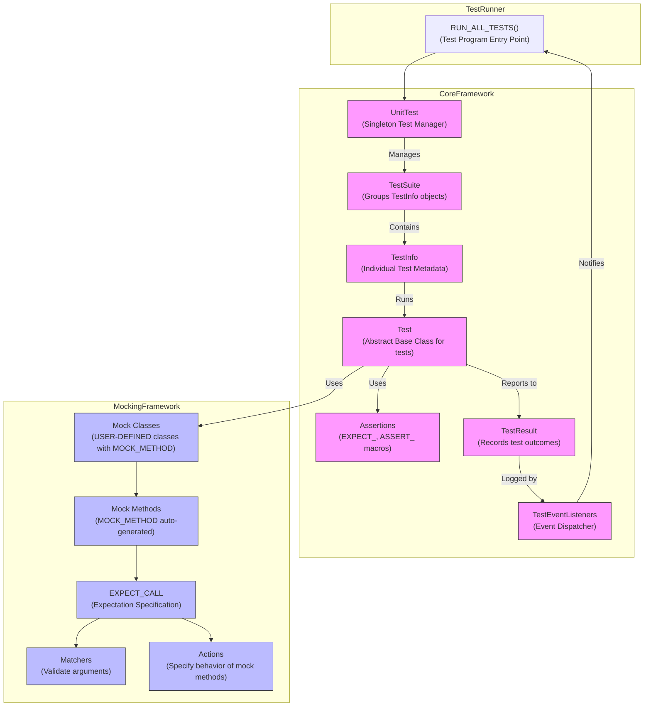
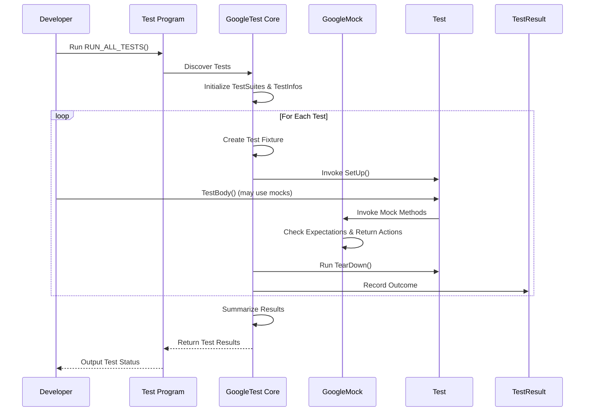

# Architecture Overview

GoogleTest and GoogleMock together form a comprehensive C++ testing framework that enables robust, scalable, and maintainable test development. Understanding their architecture will clarify how different components and APIs collaborate to deliver an efficient testing workflow.

---

## High-Level Architecture

At the heart of GoogleTest is an extensible, modular system that manages test discovery, execution, and result reporting, while GoogleMock seamlessly integrates mocking capabilities for interaction verification.

---

## Core Components

### Test Runner and Unit Test Manager

- **RUN_ALL_TESTS()** serves as the entry point for test execution, invoking the singleton `UnitTest` manager.
- The **UnitTest singleton** orchestrates test suites, manages global settings, and drives test execution flow.

### Test Suites and Test Metadata

- **TestSuite** objects categorize tests logically, each containing multiple **TestInfo** instances.
- **TestInfo** encapsulates metadata for individual tests, such as names, parameters, source locations, and execution results.

### Test Execution and Assertions

- Tests derive from the **Test** abstract class, defining `TestBody()` where assertions are made.
- Assertions like `EXPECT_` and `ASSERT_` verify conditions and determine test outcomes.
- **TestResult** records the result of each test, including failures, time elapsed, and properties.

### Event Tracking and Reporting

- **TestEventListeners** provide hooks into test lifecycle events for custom logging, reporting, and UI integration.
- They notify the runner of test starts, ends, failures, and suite completions.

---

## Mocking Framework Integration

GoogleMock is fully integrated as an extension to GoogleTest, enriching it with mock object support.

### Mock Classes and Methods

- Users define **Mock Classes** by inheriting from interfaces or abstract classes and using the `MOCK_METHOD` macro to declare mocked virtual methods.
- These **Mock Methods** automatically generate code for tracking invocations, argument matching, and behavior control.

### Expectations and Matchers

- Using `EXPECT_CALL`, tests specify **Expectations** that describe how mock methods should be called: argument values, call counts, order, etc.
- **Matchers** validate method arguments according to rich predicates.

### Actions

- **Actions** define the behavior of mock methods when invoked, such as returning values, invoking callbacks, or throwing exceptions.
- Multiple actions can be chained to mimic complex behavior.

### How Mocking Works in the Test Flow

Mocks are used within `Test` implementations to replace real dependencies with controllable *doubles*, ensuring isolated and deterministic test execution while asserting the correctness of interactions.

---

## User Workflow Visualization

This simplified flow illustrates a typical testing session:

---

## Practical Tips & Best Practices

- **Define clear test suites** reflecting the logical structure of your software for organized results and resource sharing.
- Use **test fixtures** (`TEST_F`) to reuse setup and teardown logic effectively.
- Apply **mock objects** to isolate tests from dependencies, using `EXPECT_CALL` strategically to verify critical interaction points.
- Utilize **Matchers and Actions** to make tests expressive and maintainable.
- Tap into **TestEventListeners** for custom reporting or integration with external systems.

---

## Troubleshooting & Debugging

- If tests do not run or no tests are found, verify proper usage of the `TEST` or `TEST_F` macros and ensure `RUN_ALL_TESTS()` is called.
- Unexpected mock calls or failures often result from unfulfilled expectations; run with `--gmock_verbose=info` for detailed tracing.
- Use `SCOPED_TRACE` to trace complex interactions leading to test failures.
- Clear and consistent naming of test cases and mock expectations simplifies diagnosis.

---

## References and Related Documentation

- [Testing Reference](reference/testing.md): Complete API details about test macros and value-parameterized tests.
- [Assertions Reference](reference/assertions.md): Comprehensive guide on assertion macros.
- [Mocking Reference](reference/mocking.md): Detailed reference for mocking macros and classes.
- [gMock for Dummies](gmock_for_dummies.md): Beginner-friendly introduction to mocking.
- [GoogleTest Primer](primer.md): Step-by-step tutorial for getting started with GoogleTest.
- [Advanced GoogleTest Topics](advanced.md): In-depth coverage including death tests and complex assertions.

---

For the source code and latest updates, visit the [GoogleTest GitHub repository](https://github.com/google/googletest).