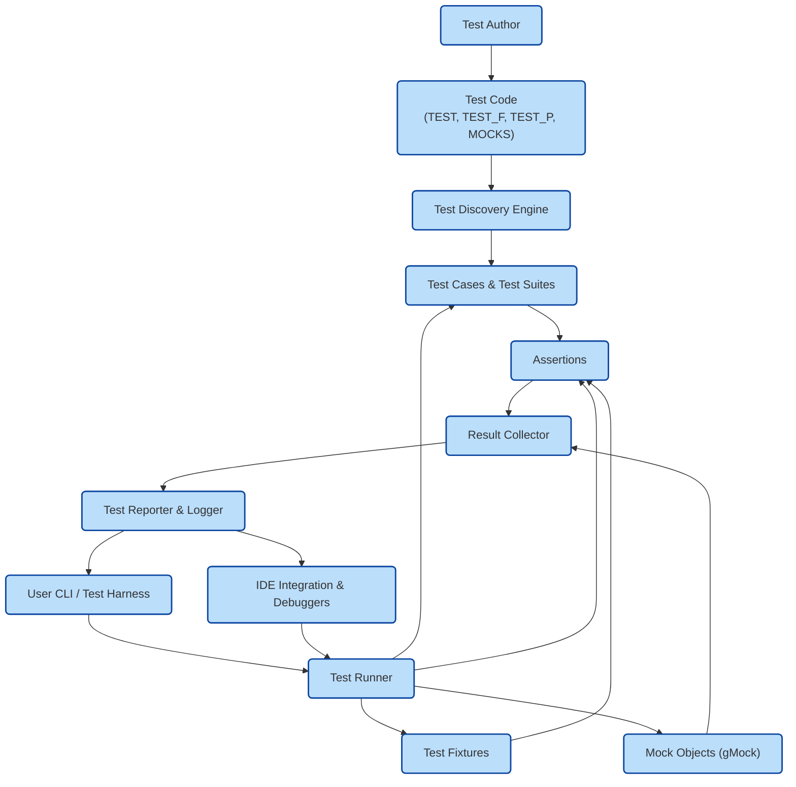

# System Architecture

## Overview

This page presents a clear, high-level view of GoogleTest's system architecture. The diagram illustrates how tests are authored, discovered, executed, and reported, alongside core components such as test cases, assertions, test runners, and mock objects. This gives you at-a-glance insight into the underlying flow and interaction of different GoogleTest elements, enabling you to understand how your tests fit within the framework.

## GoogleTest Architecture Diagram

## Detailed Explanation of Components

### Test Author
The Test Author writes test code in C++. This includes defining individual test cases using macros like `TEST()`, `TEST_F()`, and `TEST_P()` for parameterized tests. Additionally, mock classes and objects created with GoogleMock (gMock) are also written here to simulate and verify behaviors in tests.

### Test Code
This is the actual source code of your tests, containing test cases, fixtures, mock definitions, and assertions. It has a structured format understood by GoogleTest to enable automatic discovery.

### Test Discovery Engine
When a test program starts, GoogleTest’s discovery engine scans and registers all test cases and fixtures published in the test binaries. It identifies all tests declared using GoogleTest macros and prepares them for execution. This process removes manual enumeration and helps tests scale.

### Test Runner
This component orchestrates the entire testing process. Upon invocation by the user (via command line or IDE), the test runner selects which tests to run, initializes test fixtures, executes test cases, triggers mock behaviors, evaluates assertions, and captures results. It ensures proper lifecycle management for each test.

### Test Cases & Test Suites
Registered test cases form suites logically grouped by functionality or module. Each test case encapsulates one unit of logic verification, which gets executed by the test runner. Test suites allow organizing tests for clarity and selective execution.

### Test Fixtures
Fixtures provide common setup and teardown logic for multiple related tests. This ensures consistency and reduces repetition in test code. GoogleTest manages the creation and disposal of fixture instances per test run.

### Mock Objects (gMock)
Mocks supply controlled substitute implementations of dependencies. They allow specifying expected calls, return values, and interactions for effective unit testing without relying on real components. GoogleMock integrates closely with GoogleTest to verify expected behavior.

### Assertions
Assertions form the core test verifications. Each assertion checks a particular condition within a test case and signals success or failure. GoogleTest offers rich assertion macros such as `EXPECT_EQ()`, `ASSERT_TRUE()`, and advanced ones supporting custom predicates, matchers, and exception checks.

### Result Collector
As tests execute, this component collects outcomes (success or failure), captures failure details, call stacks, and error messages. It aggregates results to provide a complete status for the entire test run.

### Test Reporter & Logger
This part formats test results and logs into user-readable output. Whether shown on a terminal, IDE pane, or CI system, the reporter delivers detailed information about which tests passed or failed, failure reasons, and summaries.

### User CLI / Test Harness
The user initiates test runs via command-line interface or test harness. The CLI accepts filtering options, test selection criteria, verbosity levels, and other controls that influence test discovery and execution behavior.

### IDE Integration & Debuggers
GoogleTest integrates with popular IDEs for enhanced test navigation, debugging, and output visualization. IDE adapters communicate with the test runner and reporters to provide a seamless developer experience.

## Typical User Flow

1. **Write Tests & Mocks**: The developer writes tests using GoogleTest macros and defines mocks with GoogleMock.
2. **Build Test Executable**: The test code is compiled and linked into a test binary.
3. **Run Tests**: The user starts the test executable, optionally specifying filters.
4. **Discovery & Execution**: The discovery engine registers all tests. The test runner executes selected tests with proper fixture setup.
5. **Assertion & Verification**: Assertions and mock expectations are evaluated. Failures cause immediate reporting.
6. **Result Reporting**: Results gather in the collector and are output via reporters and optionally IDE.
7. **Debug & Iterate**: Based on reported failures, the user debugs and refines tests or production code.

## Practical Tips

- Use test fixtures to share repetitive setup code for related tests.
- Employ GoogleMock mocks to isolate units and control dependencies.
- Focus assertions on the relevant behavior to avoid brittle tests.
- Use test filters at the CLI to run subsets during development.
- Leverage verbose or IDE-integrated reports to diagnose failures quickly.

## Additional Resources

- [GoogleTest Primer](primer.md): Learn to write your first simple tests.
- [Mocking Cookbook](gmock_cook_book.md): Explore techniques for creating and manipulating mocks.
- [GoogleTest User's Guide](index.md): Comprehensive navigation and overview for all GoogleTest documentation.

---

*The visual architecture and explained flows simplify understanding GoogleTest’s components and streamline your testing workflow.*

<CallToAction>Start by exploring the [Getting Started Guide](/overview/quickstart-integration/getting-started) to write your first GoogleTest and Mock-based tests!</CallToAction>

---

<AccordionGroup title="System Architecture Details">
<Accordion title="Test Discovery Mechanism">
GoogleTest automatically discovers tests by registering them using macros expanded at compile time. This removes manual enumeration, enabling seamless scaling even with thousands of tests.
</Accordion>
<Accordion title="Test Runner Responsibilities">
Responsible for setting up test fixtures, running each test case, checking assertions, invoking mocks, and managing the lifecycle of the test run.
</Accordion>
<Accordion title="Integration with GoogleMock">
Mocks are tightly integrated, allowing detailed control and verification of interactions between objects under test and their dependencies.
</Accordion>
<Accordion title="Result Reporting Options">
Supports output in console, XML, JSON, and IDE formats, enabling flexibility in continuous integration environments.
</Accordion>
</AccordionGroup>

<Info>
This page focuses on the system-wide structure and interactions of GoogleTest components. For detailed usage of mocks, tests, or assertions, refer to corresponding guides in the documentation.
</Info>
