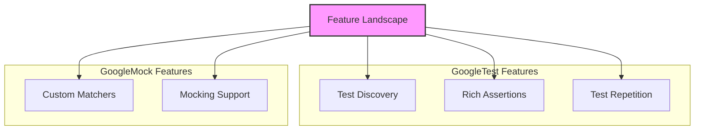

# Feature Landscape

## Overview

The Feature Landscape page offers a clear, at-a-glance comparison and summary of the crucial capabilities of GoogleTest and GoogleMock. It serves as your reference matrix that highlights key features such as test discovery, rich assertions, custom matchers, test repetition, and mocking support. Alongside brief descriptions, it points to the primary entry points in the source code where these functionalities are implemented, helping you quickly locate and understand how to utilize the framework most effectively.

This page belongs to the Architecture & Core Concepts group and complements other introductory material by giving you a structured feature snapshot before diving deep into individual concepts.

---

## Feature Matrix: Key Capabilities of GoogleTest and GoogleMock

| Feature               | Description                                                                                                  | Main Entry Points                         |
|-----------------------|--------------------------------------------------------------------------------------------------------------|------------------------------------------|
| Test Discovery        | Automatically finds and registers test cases without manual intervention.                                   | Core test registration source files      |
| Rich Assertions       | Provides a vast collection of assertion macros to validate program behavior precisely and expressively.    | Assertion macros and core assertion files|
| Custom Matchers       | Enables defining flexible rules to verify function arguments with reusable predicates or composite logic.  | Matcher interface and matcher implementations|
| Test Repetition       | Supports running tests multiple times with different parameterizations or via repetition control.          | Parameterized test infrastructure        |
| Mocking Support       | Allows creating mock classes, setting expectations and behaviors for method calls, and verifying interactions.| Mock class macros and mocking framework files|

---

## Brief Feature Descriptions & User Value

### Test Discovery
GoogleTest's ability to discover tests automatically means you don't have to manually register each test case. Write your tests and run them—GoogleTest finds and loads them for execution. This both saves time and reduces the chances of errors or omissions in your test suite.

### Rich Assertions
With GoogleTest's rich set of assertion macros, you get highly detailed failure reporting including informative error messages, which help you understand exactly why a test failed without cumbersome debug sessions.

### Custom Matchers
GoogleMock extends flexible verification by allowing custom matcher definitions. This empowers you to describe complex argument constraints clearly, reuse matcher logic, and write expressive tests that mirror your code's intent.

### Test Repetition
Whether you need to run the same test with different inputs or repeat a flaky test to confirm stability, GoogleTest provides built-in support for parameterized and repeated test execution, streamlining your testing workflow.

### Mocking Support
GoogleMock makes it straightforward to create mock versions of your classes, specify expected calls and return values, and check interaction correctness. This is critical for isolating units under test and driving design using Test-Driven Development (TDD).

---

## Navigating the Feature Landscape

This page provides you pointers to further explore each feature in detail within the GoogleTest ecosystem:

- **Test Discovery & Execution Flow:** Understand the mechanisms behind how tests are registered and run automatically.
- **Assertions:** Dive deep into the rich assertion suite GoogleTest offers.
- **Matchers API:** Explore how to use and define matchers for flexible validation.
- **Mocking Fundamentals:** Learn to build mocks, set expectations, and control mock behaviors.
- **Parameterized and Typed Tests:** Master writing reusable tests executed across multiple data variations.

Refer to the [architecture overview](/overview/understanding-architecture-concepts/architecture-overview) for a system-level understanding and to the [core concepts glossary](/overview/understanding-architecture-concepts/core-concepts-glossary) for defining domain terms.

---

## Practical Example Snippet

Here is a simplified illustration showcasing how GoogleMock integrates into your testing approach:

```cpp
#include <gmock/gmock.h>
#include <gtest/gtest.h>

class MockFoo {
 public:
  MOCK_METHOD(int, Bar, (int x), ());
};

TEST(FooTest, Example) {
  MockFoo mock;

  // Expect Bar() to be called with any integer and return 5.
  EXPECT_CALL(mock, Bar(::testing::_))
      .WillOnce(::testing::Return(5));

  int result = mock.Bar(10);
  EXPECT_EQ(result, 5);
}
```

This test automatically verifies the mock's expected method invocation and return behavior, demonstrating the seamless flow enabled by the feature set the Feature Landscape summarizes.

---

## Tips & Best Practices

- Use this Feature Landscape page to ensure you are aware of the powerful capabilities GoogleTest and GoogleMock provide before starting deeper implementation work.
- When exploring large projects, leverage the provided main source entry points to jump directly into the code that implements or controls a feature.
- Remember, the interplay between GoogleTest's assertions and GoogleMock's mocking capabilities creates a comprehensive testing toolkit ideal for modern C++ development workflows.

---

## Troubleshooting & Common Pitfalls

- Watch out for overcomplicated expectations or matchers which can make tests brittle—refer to the Mocking Cookbook and Cheat Sheet for idiomatic techniques.
- Ignoring uninteresting calls can lead to missed bugs; consider using `NiceMock` or `StrictMock` judiciously as explained in the strictness decorators documentation.
- Ensure virtual destructors in interfaces you mock to prevent leaks or undefined behavior.

---

## Next Steps

Navigate to these pages to deepen your understanding:

- [Key Features & Benefits](/overview/product-intro-value/features-and-benefits) for detailed explanations of individual features.
- [Core Concepts & Terminology](/overview/understanding-architecture-concepts/core-concepts-glossary) for domain concepts related to testing and mocking.
- [Getting Started Guide](/overview/quickstart-integration/getting-started) to setup and run your first tests and mocks.

Explore the related Cookbooks, Cheat Sheets, and API reference sections to master practical applications and advanced usages of the framework.

---

## Diagram: Feature Landscape Context



This diagram highlights how the Feature Landscape acts as a hub, connecting distinct GoogleTest features with GoogleMock extensions.

---

## Source Links

- Test Discovery source: [googletest/test/gtest-internal-inl.h](https://github.com/google/googletest/blob/main/googletest/include/gtest/internal/gtest-internal-inl.h)
- Assertion macros: [googletest/include/gtest/gtest.h](https://github.com/google/googletest/blob/main/googletest/include/gtest/gtest.h)
- Matcher API: [gmock/include/gmock/gmock-matchers.h](https://github.com/google/googletest/blob/main/googlemock/include/gmock/gmock-matchers.h)
- Mocking macros and framework: [gmock/include/gmock/gmock.h](https://github.com/google/googletest/blob/main/googlemock/include/gmock/gmock.h)
- Parameterized tests: [googletest/include/gtest/gtest-param-test.h](https://github.com/google/googletest/blob/main/googletest/include/gtest/gtest-param-test.h)

Refer to these implementation points for source-level insight.

---

For foundational concepts, see the [What is GoogleTest?](../product-intro-value/what-is-googletest) page and for practical testing patterns, check out the [gMock Cookbook](https://google.github.io/googletest/gmock_cook_book.html).


---

*Last updated with GoogleTest version from main branch.*
